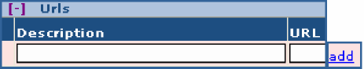
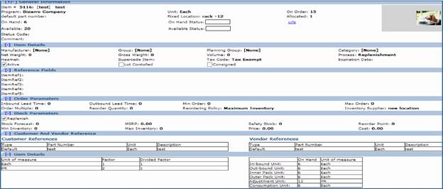
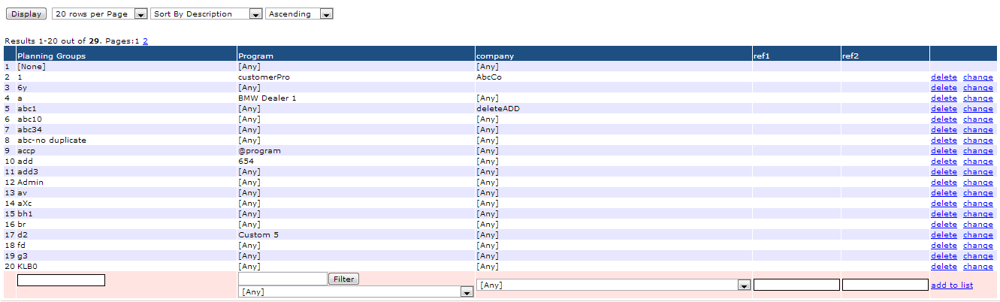
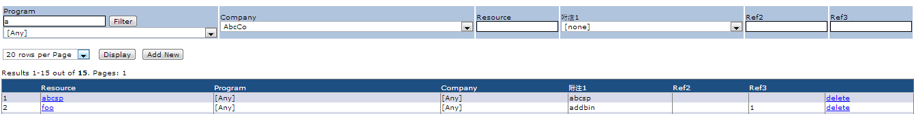
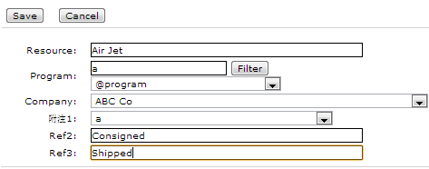
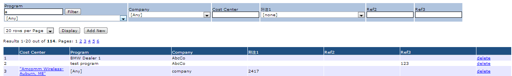
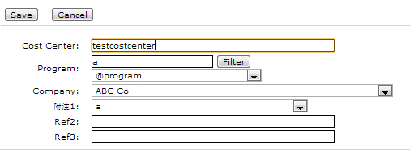
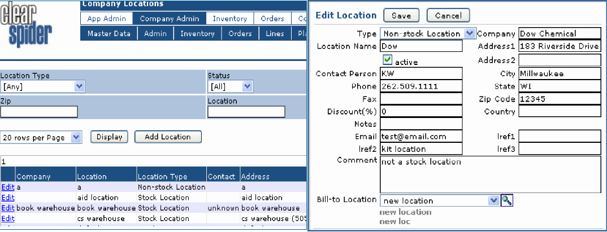
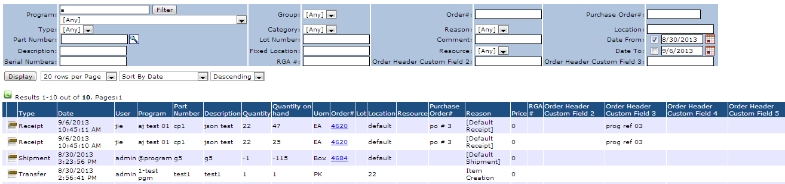

# Introduction

## Quick System Overview

Clear Spider is a specialized inventory system, with the primary purpose of accessing, monitoring and maintaining inventory from anywhere using web-enabled systems like laptop, desktop, PDA, mobile devices etc.

Clear Spider allows vendors, customers, distributors and 3rd-party logistics companies to create and participate in customized managed inventory programs. The Clear Spider system can be used in multiple ways:

**Vendor Managed Inventory:** Clear Spider allows suppliers to manage inventory and re-supply for their customers. Customers relinquish the workload of managing suppliers' parts in exchange for providing visibility into their inventory levels and requirements.

**Customer Managed Inventory:** Clear Spider allows the customer to manage specific inventory and request re-supply from their supplier based upon predetermined re-supply parameters. The Customer manages the suppliers' parts and provides visibility to the supplier so the supplier can issue the required inventory to the required stock location(s) at the right time.

**Third Party Logistics:** Clear Spider allows the supplier, the customers and their customer to view the inventory located at a third party warehouse. This mode allows the supplier to provide their goods close to their customers and allows their customer to send requests for goods directly to the warehouse for shipment.

**Return Merchandise Authorization (RMA):** Clear Spider allows the customer to return the damaged or defective goods to supplier to have the products repaired or replaced and reshipped.

The Clear Spider system provides the capability to permit inventory outside the four walls of a company to be managed by multiple parties, at multiple locations and in multiple modes. A Clear Spider Client's Customers and Suppliers, as well as their Customers and Suppliers, have the ability to see the information they require to ensure their inventory is available for the project or work at hand.

With Clear Spider's workflow engine it is easy to setup company or client specific process flows, thus making Clear Spider an ideal application to either replenish stock or fulfill orders.

### System Requirements

Before installing licensed Clear Spider software, check for the following environment requirements:

-   Application Engine Server
    -   Windows 2000 Server/Professional/XP/ 2003 server with latest service packs
-   Database Server
    -   Microsoft SQL Server 10.0/ 2008/ MSDE
-   Web Server
    -   Microsoft Internet Information Server 5.0
-   Adapter
    -   Active State PERL 5.8
-   Client (Any one)
    -   Microsoft Internet
    -   Explorer 5.5+
    -   Mozilla Firefox
    -   Safari

This guide documents, from the user's perspective, how to use the Clear Spider system on a day-to-day basis.

### About This Guide

This guide is divided into chapters and sections for quick and easy reading. The instructions in this user guide are organized by functions to correspond to the application's navigational system and functionality. Sections at the beginning of this guide are designed to direct you through the initial preparation and implementation process.

### Structure of The System

Clear Spider System user interface is designed in a drop down structure. Tabs and menus in the Clear Spider System are configurable by selecting the functions and naming them as per functional behavior; by default all the tabs, menus and functions are named. Functions are listed as drop down **menu item**s under various **menus**. Menus in turn are listed under various **tabs**. Tabs are on top of the screen. The specialty of each tab is that they are displayed depending on user role. For example: App Admin tab is displayed for only those users whose user ID is enabled for application admin role.

The illustration below shows how the tabs and menus are structured:


### Navigation

Each **menu** carries different inventory related functions, and each function can be found as a **menu item** and navigation between the menus and menu items within each tab can be accomplished by using the mouse cursor.

### Software and Inventory Terms

The purpose of this section is to better acquaint you with the terminology used in this documentation. Terms outlined in this section are used throughout this manual and Inventory System.

| Term                  | Definition                                                                                                                                                       |
|-----------------------|------------------------------------------------------------------------------------------------------------------------------------------------------------------|
| **Back Order**        | Represents items on a sales order that have not been picked.                                                                                                     |
| **Bar Code**          | Print medium we use for scanning data into our system.                                                                                                           |
| **Bar Code Scanner**  | This is a hardware component that connects to a PC and is used for scanning bar codes printed on pick lists, packing lists, and receivers.                       |
| **Button**            | Graphical means to accept an entry or submit data into our application.                                                                                          |
| **Client**            | This is Inventory Manager Component loaded on a workstation PC.                                                                                                  |
| **Company**           | Used in various areas of the software to represent an organization's name.                                                                                       |
| **Contact**           | Person's name. Format is typically First name followed by the last name.                                                                                         |
| **Cost**              | This field in the software represents the cost of an individual item in inventory.                                                                               |
| **Cycle Count**       | This is a periodic inventory counting function.                                                                                                                  |
| **Display Criteria**  | Set of functions used for displaying data in the required manner.                                                                                                |
| **Export**            | The process of taking data out of Inventory Manager for use by an external system.                                                                               |
| **Handheld**          | Represents a portable device used to perform warehouse operations like picking, shipping, receiving, etc.                                                        |
| **Inbound**           | Direction of product flow in the warehouse.                                                                                                                      |
| **Inventory**         | Represents the items in stock. It can also be used to imply the physical counting process.                                                                       |
| **IP Address**        | Network address for a given handheld or workstation PC.                                                                                                          |
| **Items**             | Representation for product or part number.                                                                                                                       |
| **Level**             | Term that refers to the physical positioning of a shelf location.                                                                                                |
| **License**           | Legal document that defines the conditions for use of the software.                                                                                              |
| **Line Item**         | Representation for product or part number. Same as Item.                                                                                                         |
| **Location**          | Precise place where product is stored.                                                                                                                           |
| **Max**               | Short for maximum. This is a field in the database that allows you to set the maximum quantity of stocking inventory.                                            |
| **Min**               | Short for minimum. This is a field in the database that allows you to set the minimum quantity of stocking inventory.                                            |
| **Move**              | The process of transferring items between locations.                                                                                                             |
| **Outbound**          | Direction of product flow in the warehouse.                                                                                                                      |
| **Packing List**      | Document that is printed after the picking process is completed.                                                                                                 |
| **Part Number**       | Representation for product. Same as Item.                                                                                                                        |
| **Picking**           | Process of filling a sales order.                                                                                                                                |
| **Pick List**         | Document that is printed for use during the picking process                                                                                                      |
| **PO Cost**           | Cost field used in the purchasing module of the software.                                                                                                        |
| **Portable**          | Represents a mobile device used to perform warehouse operations like picking, shipping, receiving, etc. same as a handheld.                                      |
| **Preferences**       | This is module in the software that is used to define user choice.                                                                                               |
| **Purchase Order**    | This is the function that allows the user to order products for receipt in the warehouse.                                                                        |
| **Qty**               | Numeric field used throughout the software to represent quantity.                                                                                                |
| **QuickBooks**        | Popular accounting software package supported in Inventory System.                                                                                               |
| **RMA**               | Return Merchandise Authorization                                                                                                                                 |
| **Receipt**           | Process of receiving products into the location/warehouse.                                                                                                       |
| **Sales Order**       | This term is used to represent the software module where customer orders are entered. It is also used to represent the printed version of that customer's order. |
| **Search Parameters** | Set of fields used to search the required data                                                                                                                   |
| **Serial Number**     | Value generated by the software during the registration process.                                                                                                 |
| **Shelf Life**        | Shelf Life is that length of time given to items (tagged items) before they are considered unsuitable for sale or consumption.                                   |
| **Shipping**          | Process performed after the picking function that signifies that the product has left the facility.                                                              |
| **Ship to**           | Field in the database that represents an alternate shipping address for a customer.                                                                              |
| **Status**            | This term is used in the software to determine the condition in an item.                                                                                         |
| **Transfers**         | This term refers to a move function between warehouses or facilities.                                                                                            |
| **UOM**               | Unit of Measure                                                                                                                                                  |
| **Username**          | User name needed to log in to the software.                                                                                                                      |
| **Vendor**            | Represents your procurement source for products                                                                                                                  |
| **Warehouse**         | Term used in the software to represent the physical location of the building.                                                                                    |
| **Worksheet**         | Refers to the document listing of items used in the cycle counting activity.                                                                                     |

# Stepping Into the System

## Understanding Clear Spider

It is important to understand at the outset what inventory management in your company means and how it will be implemented. It is possible to implement one or multiple inventory management scenarios within your organization including:

-   Managing your own inventory to meet your own, internal inventory needs
-   Managing your inventory to meet the needs of specific customers separately and securely allowing customers to use your facilities to manage their own inventories
-   Clear Spider is flexible enough to allow all of these inventory strategies

The key to inventory management in Clear Spider is the concept of the **PROGRAM**. A program is the level at which inventory is managed; that is, all inventory transactions happen at the program level. All quantities maintained by Clear Spider are done so at the program level. All transactions that affect inventory are performed using the program. All history recorded and stored in Clear Spider is managed using the program. When a new part number is created in Clear Spider, it is associated with a specific program. A part can exist in many programs and thus, inventory management of this part will occur for each program / part number combination.

The program is not only the level at which inventory is stored, it also defines a unique relationship between two companies. When a program is initially created, it is done so by defining: The two companies who will be involved in this inventory relationship:

-   Who the customer is
-   Who the vendor is
-   Several other management parameters will be discussed later.

By defining this relationship we can manage the inventory separately for these two companies and implement a tight security model around it. The figure below is a graphical representation of a simple program relationship, one that could be used for internal inventory management or with one other entity.

### A Simple Program Scenario


A more complex set of inventory relationships can exist as depicted in the graphic below. In this scenario, your company is dealing with several different customers, each requiring unique inventory management and security strategies. These relationships can be established such that the customer companies can only interact with their inventory program and be able to use, in any way, the inventory programs of other companies.

### A Complex Program Scenario


-   What type of Security Requirements do they have?
-   How do they or you want your customers to interact with the system?

Once these Questions have been answered, we can move on to configuring the system.

### Log In

When Clear Spider is first deployed for your use, you will be provided with some basic information in order to access the system. This information will include:

-   The URL (web address) to use in your web browser to enter the Clear Spider application
-   A user identifier (username) created by system administrator to log into the Clear Spider application
-   A password, associated with this username, which is required to log into the Clear Spider application

On the login page when a user key in his username and password for the first time, the password which is created by system admin gets expired and you must create new password and then login to the system (refer the below screen shot).


### Password Retrieval

Password can be retrieved using the Forgot your password? hyperlink. When this link is clicked, a screen pops up with the field to enter your **Email Address**. Once you enter email I.D. and click **Submit Request**, a password retrieval link will be sent to the specified email address. Sign into your email account, open the email sent from system@clearspider.com; click on the link. Once you click on the link, a wizard pops-up to change the password. You may go through the below screen shots to have better understanding.


```
****** PLEASE DO NOT REPLY TO THIS EMAIL ******
This email is a response to your request for password reset. To regain access to your account, please click on the following link:
https://vmi1.clearspider.com/test529/pwsReset.aspx?email=test@clearspider.com&Key=test8705 
By click on this link, will take you to a web page, where you will be able to enter a new password. If you have any problem with reset your password, Please contact us soon as possible.
Thank You,
Clear Spider Team
```

### Online Help Pages

Each screen in Clear Spider has a help page. You can refer these help pages at any point of time by just a mouse click on the help symbol.

### Home Page

Home page contains the company logo, tabs and menus, logged in user name, company, logout hyperlink, help, order summary and my to-do List.

| **Element**        | **Description**                                                                                                                                                                                                                                                                                                                                                       |
|--------------------|-----------------------------------------------------------------------------------------------------------------------------------------------------------------------------------------------------------------------------------------------------------------------------------------------------------------------------------------------------------------------|
| **Company Logo**   | Every screen in the system has company logo. At any point of time if you wish to return back to home page you can click on the company logo.                                                                                                                                                                                                                          |
| **Tabs and Menus** | As explained earlier the Clear Spider System is designed into drop down tabs and menus. Each menu has many menu items and these are different functions of the system. Logged in user name and company: Top right of the home screen holds logged in user name and company to which the user belongs.                                                                 |
| **Log Out**        | Use log out function to exit the system.                                                                                                                                                                                                                                                                                                                              |
| **Help**           | Use help to know the use of order summary page.                                                                                                                                                                                                                                                                                                                       |
| **Order Summary**  | The Order Summary section of this screen summarizes the open Inbound and Outbound orders that exist in the system. This summary can be filtered by requesting a specific program.                                                                                                                                                                                     |
| **My To-do List**  | This shows at a glance outstanding orders with a process step. These orders are orders upon which some action must be initiated by user. To deal with a particular order, the user needs to simply click on the appropriate line in the to-do list and the hyperlink will take the user to the appropriate transaction screen with the appropriate order information. |


### Common Features

There are few common features used throughout the system. These Features include:

| **Feature**                         | **Description**                                                                                                                                                                                                                                                                                                                                                                                                                                   |
|-------------------------------------|---------------------------------------------------------------------------------------------------------------------------------------------------------------------------------------------------------------------------------------------------------------------------------------------------------------------------------------------------------------------------------------------------------------------------------------------------|
| **Exporting Reports**               | All reports, including inventory summary, billing history, purchase order history, invoice report, pick list, pack list, monthly & weekly transactions, inventory valuation, line shortage, tracking, order lines, lines of acknowledgment, lines of schedule and many more reports can be exported using excel format. To export using excel format you have to click on this symbol and download/open the excel format report on your computer. |
| **Look Up**                         | In Clear Spider, some important data search can be done using Look up function is mainly used for: Part Number, Location, Tag, Tag type, Production item kit.                                                                                                                                                                                                                                                                                     |
| **Calendar**                        | Throughout the Clear Spider system, calendar can be recognized with this icon.                                                                                                                                                                                                                                                                                                                                                                    |
| **Serial Number/<br>Process Steps** | This sign is used to check serial numbers of an order item or check order process steps during creation of an order.                                                                                                                                                                                                                                                                                                                              |
| **Switch View Mode**                | Switch view mode provides a detailed or brief view of purchase and sales orders.                                                                                                                                                                                                                                                                                                                                                                  |
| **Print**                           | The Print button enables you to print the report.                                                                                                                                                                                                                                                                                                                                                                                                 |
| **Labels**                          | Print labels represented by                                                                                                                                                                                                                                                                                                                                                                                                                       |
| **Item Details**                    | Item details on adjustment, consumption and cycle count represented by                                                                                                                                                                                                                                                                                                                                                                            |
| **Check Box**                       | In this system, check box is mainly used for indicating status, such as active order, active location, cosigned item, replenishment etc.                                                                                                                                                                                                                                                                                                          |
| **Buttons**                         | Push buttons are used to accept, edit, search and display data throughout the system. Some of the most common buttons in this system are:                                                                                                                                                                                                                                                                                                         |
| **Display Selection**               | Data display can be by your choice of view by using some of the defined display criteria.                                                                                                                                                                                                                                                                                                                                                         |

# Getting Started

## First Steps

As discussed earlier, once the information has been gathered regarding your inventory strategy, we can begin to configure the system.

We first have to gather the data which is involved in the inventory operations. Clear Spider has its own defined way of accepting data. So let us learn step by step and start collecting data:

## Creating Companies

At least two companies are required in order to create a program.


In the scenario where you are simply managing your own inventory, the question arises as to who the second company is. When your Clear Spider database was initially created, your company name was inserted into the database using the organization name that you defined in initial discussions with Clear Spider. As well, a company named "Clear Spider Inc." was inserted into the database. These two companies provide the needed company definitions in order to set up an internal program definition. The Clear Spider Inc. Company will be used to define the program relationship and then, from that time forward, will be ignored in your use of the system.

If however, you are planning to have inventory moving between multiple companies, then the appropriate companies must be created. Let's create a company:

### Search And Edit Company Details

A set of search parameters can be used to retrieve the saved company/companies and its details. You can enter company name, phone number, zip code, contact name, reference field details, company attribute, and its value. You can enter any/all/none of the information to display company details. The search result is the brief report for the company (refer to snap shot 1). In case if you are unable to provide any information, you can just click **Display**. You get list of companies which includes your company details as well as companies associated with your company (refer to snap shot 2).

To **edit** any company details, display the list of companies and select company name which requires editing (company name is hyperlinked). Once you click on the company name, it will take you to the edit company page, where you can edit company details.


## Creating Programs

After creating at least two companies, you are now ready to add programs. Programs can be of two types: a) **Customer Program** b) **Vendor Program**

A Customer program establishes your company as the vendor and the other company as the customer. A vendor program does the reverse - it establishes your company as the customer and the other company as the vendor. As we will see shortly, the use of one type of program over the other will have an impact on the part numbers that are displayed. The diagram below graphically illustrates the relationships formed by these two types of programs from the perspective of a user defined within **My Company**.


**My Company** user would be able to view any items that are defined in the **Customer Program** and the **Vendor Program**. A user associated with **Customer Company** would be able to view only those items defined in the **Customer Program** and a user associated with the **Vendor Company** would be able to view only those items defined in the **Vendor Program**.


Let's try to add program to an existing company. Click on **Company admin** tab, move cursor to **master data** menu, select **Programs** from the drop down list. Click **Add**.


As shown in the screen shot you can use multiple fields like program name, company, replenishment location, custom/vendor account number, custom fields, attribute to search a program. You can use all/none/any of the search parameters to search program/programs and click on **Display** to view results.

### Adding Items

Once programs for companies created, we can start adding items for each program. To add item click on **company admin** tab, select items under master data menu. Click **Add New** button. Now you get the below screen


Item creation screen gives you the opportunity to fill all the details that is associated with item. Let us briefly discuss on the whole process of item creation. (Fields in red are the required fields and they must be filled in order to add an item to system database):

| **Field**                           | **Description**                                                                                                                                                                                                                                                                                                                                                                                                                                                                                                                                                                                                                                                                                                                                                                                                                                                                                                                                                                                                                                                                                                                                                                |
|-------------------------------------|--------------------------------------------------------------------------------------------------------------------------------------------------------------------------------------------------------------------------------------------------------------------------------------------------------------------------------------------------------------------------------------------------------------------------------------------------------------------------------------------------------------------------------------------------------------------------------------------------------------------------------------------------------------------------------------------------------------------------------------------------------------------------------------------------------------------------------------------------------------------------------------------------------------------------------------------------------------------------------------------------------------------------------------------------------------------------------------------------------------------------------------------------------------------------------|
| **Program**                         | Select a program to which we are going to add an item.                                                                                                                                                                                                                                                                                                                                                                                                                                                                                                                                                                                                                                                                                                                                                                                                                                                                                                                                                                                                                                                                                                                         |
| **Stock Item Number**               | Key in item number/part number.                                                                                                                                                                                                                                                                                                                                                                                                                                                                                                                                                                                                                                                                                                                                                                                                                                                                                                                                                                                                                                                                                                                                                |
| **Description**                     | Write item/part description.                                                                                                                                                                                                                                                                                                                                                                                                                                                                                                                                                                                                                                                                                                                                                                                                                                                                                                                                                                                                                                                                                                                                                   |
| **Process**                         | The default process associated with this part.                                                                                                                                                                                                                                                                                                                                                                                                                                                                                                                                                                                                                                                                                                                                                                                                                                                                                                                                                                                                                                                                                                                                 |
| **Expiration Date**                 | Expiration date has to be set for each item created. By default, expiration date is set to six months from the date of item creation.                                                                                                                                                                                                                                                                                                                                                                                                                                                                                                                                                                                                                                                                                                                                                                                                                                                                                                                                                                                                                                          |
| **Fixed Location**                  | A specific place in the warehouse where this part will be stored. This field value is for descriptive purposes only.                                                                                                                                                                                                                                                                                                                                                                                                                                                                                                                                                                                                                                                                                                                                                                                                                                                                                                                                                                                                                                                           |
| **Category**                        | Item category is a value assigned to a part number for purposes of grouping parts into like segments. These values can be used to allow the user to select and report on the parts based upon this segmentation. An example of a category could be "fasteners", category that include bolts, screws, nails, clamps, etc. Categories are predefined by the user through the Item Categories transaction.                                                                                                                                                                                                                                                                                                                                                                                                                                                                                                                                                                                                                                                                                                                                                                        |
| **Item Group**                      | Item group is another value used to gather parts into like segments. It can be used individually or in conjunction with other grouping fields and is used for reporting purposes. Following the example from Category above, an item group could be "screws", "bolts", "nails", etc.. Groups are predefined through the Item Groups transaction.                                                                                                                                                                                                                                                                                                                                                                                                                                                                                                                                                                                                                                                                                                                                                                                                                               |
| **Manufacturer**                    | The Company that manufactured this part. Manufacturers are predefined through the Item Manufacturer transaction.                                                                                                                                                                                                                                                                                                                                                                                                                                                                                                                                                                                                                                                                                                                                                                                                                                                                                                                                                                                                                                                               |
| **Planning Group**                  | Planning group is another value used to gather parts into like segments and is used for reporting purposes. Typically, planning groups have been used to segment the parts by value through the A-B-C classification technique. An "A" part is a high value part that should be managed with a high degree of scrutiny. On average, 20% of the parts in a company's inventory represent 80% of the value of the entire inventory. Thus, these parts would be assigned a planning code of "A", while the most inexpensive parts would be assigned a planning code of "C".                                                                                                                                                                                                                                                                                                                                                                                                                                                                                                                                                                                                       |
| **Tax Code**                        | Tax Code for the item has to be selected from the drop down list. They are predefined using Tax Code menu item under Master Data.                                                                                                                                                                                                                                                                                                                                                                                                                                                                                                                                                                                                                                                                                                                                                                                                                                                                                                                                                                                                                                              |
| **Hazmat**                          | It's an open field, here you can denote if the item is hazardous material or not (Yes or No). Or if you have different codes for hazardous material that can be keyed in here                                                                                                                                                                                                                                                                                                                                                                                                                                                                                                                                                                                                                                                                                                                                                                                                                                                                                                                                                                                                  |
| **Ref1, Ref2, Ref3, Ref4 and Ref5** | These are customizable fields and are open-text fields that are used to segment like parts. These fields can contain any value that the user wishes, but to ensure accurate reporting of data should be used consistently for all parts. The customization of these fields can be done using system parameter page.                                                                                                                                                                                                                                                                                                                                                                                                                                                                                                                                                                                                                                                                                                                                                                                                                                                            |
| Inventory Supplier                  | The location in the system identified to be the supplier of this item. This system will use the Replenish Location of the Program record as the default location for this value. The Inventory Supplier code will also be used on the orders created by the system's Replan function.                                                                                                                                                                                                                                                                                                                                                                                                                                                                                                                                                                                                                                                                                                                                                                                                                                                                                          |
| **Comments**                        | Enter any special notes about the item                                                                                                                                                                                                                                                                                                                                                                                                                                                                                                                                                                                                                                                                                                                                                                                                                                                                                                                                                                                                                                                                                                                                         |
| **Quantity On Hand**                | Can be filled in when adding the new item, if the on-hand quantity for that part is known                                                                                                                                                                                                                                                                                                                                                                                                                                                                                                                                                                                                                                                                                                                                                                                                                                                                                                                                                                                                                                                                                      |
| **Unit of Measure**                 | It is the definition of how inventory for this part is stored and tracked. For example, the part could be tracked individually which would result in a unit of measure of Each (ea), or the party could be stored and tracked by liters in which case the unit of measure would Liters (L). Unit of Measure is a predefined list of values and can be modified by calling Clear Spider.                                                                                                                                                                                                                                                                                                                                                                                                                                                                                                                                                                                                                                                                                                                                                                                        |
| **Net Weight**                      | The net weight of a unit of the part                                                                                                                                                                                                                                                                                                                                                                                                                                                                                                                                                                                                                                                                                                                                                                                                                                                                                                                                                                                                                                                                                                                                           |
| **Gross Weight**                    | The gross weight of a unit of the part.                                                                                                                                                                                                                                                                                                                                                                                                                                                                                                                                                                                                                                                                                                                                                                                                                                                                                                                                                                                                                                                                                                                                        |
| **Replenish**                       | A flag that is checked or not to indicate whether this part should be considered when the Replan function is executed. If the flag is checked, the inventory situation for the part and the inventory planning parameters associated with the part are checked and new replenishment orders added to the system if required.Forecast- A number that indicates an estimate of the number of items that will be consumed each month. This value is for documentation purposes only.                                                                                                                                                                                                                                                                                                                                                                                                                                                                                                                                                                                                                                                                                              |
| **Maximum Inventory**               | The maximum number of units that the company desires to maintain in inventory at any point of time. This parameter is considered if the Reordering Policy is set to Maximum and will be used in conjunction with other inventory parameters to calculate a reorder quantity to bring the inventory level back to the maximum quantity.                                                                                                                                                                                                                                                                                                                                                                                                                                                                                                                                                                                                                                                                                                                                                                                                                                         |
| **Minimum Inventory**               | The minimum number of units that the company desires to maintain in inventory at any point of time. It is necessary that inventory should not go below this level. This parameter is considered if the Reordering Policy is set to Maximum and will be used in conjunction with other inventory parameters to display graphs of the status of the inventory for the item.                                                                                                                                                                                                                                                                                                                                                                                                                                                                                                                                                                                                                                                                                                                                                                                                      |
| **Reorder Point**                   | If the item's Reordering Policy is set to Reorder Point, then this field and its value are used:<br>In the creation of the On-hand and Available graphs on the Item List. The On-hand and Available quantities will be compared to the Reorder Point and the appropriate color and length of the graph bar will be determined<br>To determine if the system's Replan function should generate a replenishment order for this item. If the On-hand quantity is at or below the Reorder Point, the system will create a replenishment order for the item.                                                                                                                                                                                                                                                                                                                                                                                                                                                                                                                                                                                                                        |
| **Safety Stock**                    | Safety stock provides protection against running out of stock during the time it takes to replenish inventory. It allows the company to maintain customer service levels while at the same time maintaining the minimum level of inventory. The value set here will affect the graphical display of on-hand and available inventory for a part. If these levels are at or below the defined safety stock, the graphical display will be colored red to indicate a potential serious inventory issue or stock-out.                                                                                                                                                                                                                                                                                                                                                                                                                                                                                                                                                                                                                                                              |
| **Unit Price**                      | This is the default price used when the item is sold to a customer and the invoice is created                                                                                                                                                                                                                                                                                                                                                                                                                                                                                                                                                                                                                                                                                                                                                                                                                                                                                                                                                                                                                                                                                  |
| **Unit Cost**                       | This is the cost per unit of inventory to your company                                                                                                                                                                                                                                                                                                                                                                                                                                                                                                                                                                                                                                                                                                                                                                                                                                                                                                                                                                                                                                                                                                                         |
| **MSRP**                            | Manufacturer's Suggested Retail Price.                                                                                                                                                                                                                                                                                                                                                                                                                                                                                                                                                                                                                                                                                                                                                                                                                                                                                                                                                                                                                                                                                                                                         |
| **Reordering Policy**               | The parameter which dictates when and how replenishment order quantities will be created and how the graphical display of the on-hand and available inventory levels will be displayed. The values that can be selected here are Maximum Inventory and Reorder Point.<br>Maximum Inventory dictates that inventory should fall to no less than the minimum inventory parameter and should rise to no more than the maximum inventory parameter. When a replenishment order is generated by the system, this order policy first compares the available quantity to the minimum level. If Available quantity is less than minimum, then a replenishment order is placed with an order quantity to be ordered is calculated as the difference between the maximum inventory parameter and the available quantity. Available quantity is calculated as the total of the on-hand quantity plus the on order quantity minus the allocated quantity.<br>Reorder Point dictates that when the available quantity falls to or below the defined reorder point quantity, a replenishment order will be placed with an order quantity equal to the reorder quantity defined for the part. |
| **Inbound Lead Time**               | The amount of time in days that it takes to have this particular part delivered from the supplier.                                                                                                                                                                                                                                                                                                                                                                                                                                                                                                                                                                                                                                                                                                                                                                                                                                                                                                                                                                                                                                                                             |
| **Outbound Lead Time**              | The amount of time in days for your company to deliver this part to a customer                                                                                                                                                                                                                                                                                                                                                                                                                                                                                                                                                                                                                                                                                                                                                                                                                                                                                                                                                                                                                                                                                                 |
| **Order Multiple**                  | A factor used in the REPLAN function to generate replenishment orders. The Order Multiple value will cause the quantity to be ordered to round up to the next multiple. For example, if the order multiple is 10 and the quantity needed is 75, the REPLAN function will order 80 units of the part; if the order multiple was 6 and the quantity needed is 75, then the REPLAN function would order 78 units.                                                                                                                                                                                                                                                                                                                                                                                                                                                                                                                                                                                                                                                                                                                                                                 |
| **Reorder Quantity**                | The number of parts that are ordered on a replenishment order, created by the Replan function, when the reordering policy of Reorder Point is used.                                                                                                                                                                                                                                                                                                                                                                                                                                                                                                                                                                                                                                                                                                                                                                                                                                                                                                                                                                                                                            |
| **Minimum Order Qty**               | The quantity of parts that should be ordered                                                                                                                                                                                                                                                                                                                                                                                                                                                                                                                                                                                                                                                                                                                                                                                                                                                                                                                                                                                                                                                                                                                                   |
| **Maximum Order Qty**               | The maximum number of parts that will be ordered on a given replenishment order when the REPLAN function of the system generates a replenishment order.                                                                                                                                                                                                                                                                                                                                                                                                                                                                                                                                                                                                                                                                                                                                                                                                                                                                                                                                                                                                                        |

### Part Number References

The system has the ability to reference item data using alternate part numbers which are added and maintained via the Customer References and Vendor References sections of the Create Item and Edit Item screens. Shown below is an example of these sections.


When an item is added to the system via the procedure described above, the Part\# and Description are added to both these sections. As can be seen above, there is one entry in each section that carries a Part number and Description. These two entries carry a Type of default which is added when the item was created. Additionally, the Description field carries a value of default. The two values, Part\# and Description, in both the Customer References and Vendor References, can be changed to whatever the users requires. These part numbers, under the heading Part\#, are the identification labels that are displayed on the Item list. The company to which the user belongs determines which of these two identifiers will be displayed on the various system screens and printed reports.

To add a new number by which a user can reference a part requires the Customer Reference and/or Vendor Reference information be completed. A Reference Type must be selected. The values in this drop-down list are pre-defined using Cross Reference Types maintenance transaction. A Unit of Measure must be selected from the associated drop-down list and assigned to this new part number. A unique Part\# must be included and a part Description provided.

Once a part number has been added through this method on either the Vendor or Customer Reference side, it can be used in any of the other transactions in the system that take a part number as input. The part that will be retrieved will carry the part number that was defined as the Stock Item Number when the part was originally created.

### Units Definition


When a part is originally created, it carries a stocking Unit of Measure that is defined by the user by selecting a value from a drop-down list. However, in some scenarios, it may be necessary to manage a part in a different unit of measure with different multiply factor and divide factor. For example, a manufacturer may purchase screws in a 'Box'. And the Box contains 10 'Packs' of screws with 10 in 'Each' Pack. One more scenario can be a part using a unit of measure of "each", but issue quantities of this part to their manufacturing floor in quantities measured in "feet". To do this requires a conversion factor to translate "each" to "feet". Units Definition transaction allows documentation of this conversion and is accomplished by specifying new Unit of Measure and the conversion Factor from the original unit of measure to this new one and clicking on Add button associated with this transaction. For each new unit of measure and associated conversion factor to be added, this process must be followed. See below an example how unit definition factor and divide factor works.


These Units of Measure can be deleted from the system by simply clicking on the word delete associated with each entry currently documented in the system.

After filling the above fields click **Done** to save the item in the system. Click **Cancel** to cancel the action.

### Search And Edit Item


Search Item: When you have a long item list for different programs it becomes difficult to view the desired item details. In order to overcome this difficulty we have set of search parameters (as seen above screen shot):

-   Program
-   Part Number
-   Serial Number
-   Description
-   Category
-   Group
-   Manufacturer
-   Planning Group
-   Fixed Location
-   Attribute
-   Tax Code
-   Ref1
-   Ref2Ref3

You can have a desired display by using display criteria:

-   Rows per page
-   Sort by
-   Sort order

### Edit Item

Each item can be edited using edit hyperlink (see the screen shot above). This edit hyperlink takes you to Edit Item screen. Here you can edit the item details (those listed in add item) except for on hand quantity. And there are some more fields available during item editing. They are described with screen shots below:

### Item Attributes


There may be a need to have additional parameters available, beyond those provided by the system (e.g., Group Code, Category Code, Planning Group), to further label and group items. This can be accomplished by creating new Item Attributes through this transaction. The Item Attribute Name must be specified along with the appropriate value. Any Name and Value can be defined, but their usefulness is dependent upon consistent application to items. Parts then can be retrieved from the system using these assigned attribute values through the Items List transaction in the Master Data tab. Here, one of the search criteria is the Attribute name and associated value.

### Item Image

To add the item image, click on hyperlink Item Images; this action navigates to Inventory Image screen where you can enter image description, browse the image file or fill image web URL.


### URLs

To get the additional reference information for a part, the user can be directed to a specific internet address (URL). This is accomplished by adding a URL for the part. This transaction is found at the bottom of the **Create Item** transaction and is optional in its use. To create the URL, enter a descriptive **Name** for it and the actual **URL** in the standard format of www.itemurl.com. Through the View Item transaction, URL information will be displayed and user can click on the link which direct to the associated web site.



### View Item



Each item in the system contains a hyperlink to view its details. A click on hyperlinked item takes you to View Item screen, where complete details of an item can be obtained (refer to the above screen shot)

In this screen, you can see the Item ID assigned by the system on the top left corner along with part number and item description.

All the other details of item are shown as entered by you during item creation or during item edit. Item image can be viewed if uploaded during item creation.

A mouse click on Item URL opens up the appropriate item link page.

## Auto - Create Program Data

There is a quick way of creating program data (it's nothing but creating items for programs). To do so click on company admin tab, place mouse cursor on master data, and select Auto - Create Program You can add data for a new or existing program under a new company or an existing company. Select a program, program type, program for company - key in the company name if it's for a new company or if it is for existing company, select a company name from the drop down list. Key-in Item part number, item description, maximum inventory, quantity on hand, select reordering policy, quantity to reorder and reorder point. Click on button to save the data. Click Cancel to discard the data.

You can see the item created for program using this function in item list. If you select a new program to add the data, the program name will be automatically stored same as company name. Now let us add some more data and learn how to edit them in order to make inventory transactions smoother.

## Cross Reference Types

The Clear Spider system allows the user to define additional part numbers to be defined and associated with the primary customer and vendor part numbers that were defined when the item was created. These additional part numbers are cross-reference part numbers and for each one a Type code is associated with it. These type codes are user-definable through the Cross Reference Types table maintenance screen. Refer the screen shot and text above to add, modify and delete Cross Reference Type.

## Data Lists

A collection of data can be stored within the system using data lists. These fields can be added to various parts of the system for convenience. They can be entered manually or uploaded from a file.

1.  Using the Menu, select *Company Admin \> Master data \> Data List*.  
    
2.  Enter the Code and Description of the list.
3.  Select the Data type of text, number or date.
4.  Select how the list will be sorted.
5.  Add it to the list.
6.  Delete the list and its contents. If you wish to keep the list but delete the contents within, use Purge feature.

Selecting **Change** changes the look and feel of the table. The code and description becomes enabled for editing and now contains the save and cancel links.

There are two methods to adding data to a data list once created. The first is using the Data List Items link. Click the data list you want to add data to, which will navigate you to the Data List Items page. Clicking **Add New** will open a new form on the page.


### Upload Data List

The second method for uploading items is using the upload feature. This will navigate you to Upload Data Lists page.


### Deactivate Items

Two icons, js on click event, color labeled fields in xml file are added as shown in the figure below:

.jpg)

## Item Attribute Types

Attributes are additional descriptive values which can be associated with Companies, Items, Order Headers, Order Lines, Programs and Users in the system. These attributes can be used in any required way.

Attribute description can be anything related to any of the above-mentioned types. For example: For items you can create attributes as label color (barcode label), height, weight, width and so on. For Company - Origin, Branch and so on. These attributes can be viewed on the respective 'Type' pages. If you pick 'Any' then you can view the attribute on all the 'Type' pages.

.png)

## Item Categories

Item Category is a field that is used to gather like items together for selection and reporting purposes. This field works independently from any other grouping field. The screen lists the existing codes and allows adding, editing and deleting category. Each category can be associated with program. If a category is required in many or all the programs of the company, then you can add a category for 'Any' in the program drop down list. See the above screen shot and text to add, modify and delete Item Category.

1.  Using the Menu, navigate to Item Categories via *Company Admin \> Master Data \> Item Categories*.

    

2.  Enter the Categories of the item.
3.  Select a Specific Program or [ANY].
4.  Select a Specific Company from the dropdown list.
5.  Enter values for Ref1 and Ref2 fields.
6.  Add the Category to the list.
7.  Delete the selected record.

Selecting **Change** changes the look and feel of the table. The name becomes enabled for editing and now contains the save, cancel, and delete links.

## Item Group

Item Groups are user-defined labels which are used to logically group items together. There is no fixed definition as to how this field may be used, but the Item Group field is used by many of the system functions to select and report on items in the system. Each group can be associated with program. If a category is required in many or all the programs of the company, then you can add the group for 'Any' in the program drop down list. See the below screen shot and text to add, modify and delete Item Group.

1.  Using the Menu, navigate to Item Groups via *Company Admin \> Master Data \> Item Groups*.

    

2.  Enter the Item of the item.
3.  Select a Specific Program or [ANY].
4.  Select a Specific Company from the drop-down list.
5.  Enter values for Ref1 and Ref2 fields.
6.  Add the Item Group to the list.
7.  Delete the selected record.

Selecting **Change** changes the look and feel of the table.The name becomes enabled for editing and now contains the save, cancel and delete links.

## Item Manufacturer

The Item Manufacturer is a pre-defined code identifying who manufactured the associated item. Below screenshot and text explains how to add and modify item manufacturer list. Each manufacturer can be associated with program. If a manufacturer association in a company is required for more than one program, then you can add the manufacturer for 'Any' in the program drop down list.

1.  Using the Menu, navigate to Item manufacture via *Company Admin \> Master Data \> Item Manufacture*.

    

2.  Enter the Manufacturer of the item.
3.  Select a Specific Program or [ANY].
4.  Select a Specific Company from the drop-down list.
5.  Enter values for Ref1 and Ref2 fields.
6.  Add the Manufacturer to the list.
7.  Delete the selected record.

Selecting **Change** changes the look and feel of the table.The name becomes enabled for editing and now contains the save, cancel, and delete links.

## Item Planning Group

The Item Planning Group field is another field that allows the user to gather like parts together into groups. Quite often, this field is used to implement the "ABC-classification" of parts. Using this label technique, the high values parts (generally 20% of your inventory quantity that represents 80% of the value of your inventory) would be labeled as "A" parts and would typically be cycled counted much more frequently than any other part. Conversely, parts that carry a very low unit cost would carry a "C" label and would not be counted very frequently, if at all.

1.  Using the Menu, navigate to Item Planning Group via *Company Admin \> Master Data \> Item Planning Group*.

    

2.  Enter the Item Planning Group.
3.  Select a Specific Program or [ANY].
4.  Select a Specific Company from the drop-down list.
5.  Enter values for Ref1 and Ref2 fields.
6.  Add the Item Planning Group to the list.
7.  Delete the selected record.

Selecting Change, changes the look and feel of the table. The name becomes enabled for editing and now contains the save, cancel and delete links.

## Item Group By Program

Item Groups and Tax Code can be applied to items in program using this page. You can apply groups and tax codes at one shot for all items or one by one by selecting each item.


This function is under Master Data menu. To update group or tax code items of a program, use program filter to select a program or directly choose a program from the drop down list and click **Display** to list the items of that program. Once items are listed, you can either select all or any items (using check box) that you want to update to a particular item group or tax code. Above the results page you can see two drop down list and update button, to update item group select from item group for update items drop-down list and click on To update Tax Code select from Tax code for update items drop down list and click **Update**.

## Program Groups

Program Groups can be used to set up a hierarchical grouping of the inventory programs and associated inventory data for reporting purposes. You can define as many levels in the hierarchy as is required. This hierarchy is used in the Inventory Totals Report. When the user enters the Program Groups screen under Master Data menu the first value displayed is + [program groups]. Upon clicking the "+" sign, the hierarchy of the program groups will be exposed. At each level the system will display a line containing the words "[create new group here]". When this hyperlink is clicked, the user will be prompted to provide a new Program Group name associated with the appropriate Parent Group. This Parent Group is pre-populated with the group name under which the new name is being added and can be overridden.


## Item Serial Numbers

Serial Numbers can be assigned to any items in the system. To achieve this select Item Serial Number menu item under menu Master Data. Select a program, look up for the part number of an item, input the quantity of item for which you are going to assign serial number and key in one sequence of serial number to begin with and click on Generate button. This transaction will generate the serial numbers for the specified quantity of the selected part number of an item in the program.


## Shipping Agents

The Shipping Agent code is used on Inbound and Outbound orders indicating which service is transporting the items from one location to another. Shipping Agent is a menu item under menu Master Data. In order to save shipping agent code in the system database follow the instructions mentioned on the screen shot.


## Resources

Resources are means of adding items to the system and are also used in production and distribution of items like people, machines, tools etc. To add a resource click on company admin tab, place mouse cursor on master data and select Resource.

Examples of Resources are: EDI, air, land, etc.

1.  Select a specific program, company, or Ref1 field from dropdown list.
2.  Click **Display**.

    

3.  Add a new Resource.
4.  Select a Specific Program and Company from the drop-down list.
5.  Add Ref1, Ref2 and Ref3 fields
6.  Click **Save**.
7.  Note to add a Resource to all the programs at once select [ANY] from Programs drop down.

    

### Company Cost Centers

A New Page is added including Program Filter, Company Filter, Cost Center, Ref1, Ref2, and Ref3. It also displays all the Cost Centers and we can edit and delete them.



1.  Add a new Cost Center Name.
2.  Select a Specific Program and Company from the dropdown list.
3.  Add Ref1, Ref2, and Ref3 fields.
4.  Click Save.
5.  To add a Resource to all the programs at once select [ANY] from Programs drop down.

    

### Tax Code

Association of tax type to an item or program is indicated by tax code in the system. An item or a program can be tagged to a tax code during their creation. (As discussed in item and program section). Example of Tax Code can be: Exempt, Taxable, etc.

1.  Click on company **Admin** tab.
2.  Place mouse cursor on master data.
3.  Select **Tax Code**.

    

## UOM


UOM stands for Unit Of Measurement. It is the means of measuring every unit (part/item) in the system. This screen allows you add, modify and delete UOM description and code (Refer the above screen). This unit of measure could be units of the item, weight of the item, length in feet of the item, etc. When you view the inventory level of an item and see a quantity, this quantity is expressed in the defined unit of measure. However, there are situations where you may store inventory in one unit of measure, but, at times, manipulate the inventory in another unit of measure. This system allows you to create definitions of these additional units of measure and the conversion factor between them and the primary unit of measure.

## Reason Codes

When inventory transactions are processed by the user, there may be a requirement to identify why the transaction is being performed. Through pre-defined Reason Codes, the user can capture the purpose of the transaction.

Reason Codes are associated with a specific inventory transaction such as Adjustment, Consumption, Cycle count, Shipment, Receipt etc. The format of the code is free form and an unlimited number of codes can be associated with the inventory transaction for future use. Reason Code is a menu item under the menu Master Data.

To add a Reason Code to database, select a Transaction Type from the drop down list.


## Locations



Location is a place to store inventory. It can be a warehouse, factory outlet, company premises or any inventory storage area. In the Clear Spider System Location is classified into two types: Stock Location and Non-Stock Location. There are two functional differences of stock and non-stock locations in Clear Spider system. They are:

-   Stock location can be tagged to a program during the creation of a program, while non-stock location is just an address and available only during inventory order creation.
-   Stock location appears on the drop down list of from and to location on the inventory order screen. Non-stock location is available from the location lookup icon.

To add a new location to the system database:

1.  Click the **Locations** menu item under **Master Data** menu.
2.  Click **Add Location**.
3.  Enter in the following details:
    -   **Type**: It is automatically selected, but can be overridden
    -   **Location Name**: The Location Name must be filled in as it is the key value that is displayed and which is used to modify existing data.

        If you want make this location as default location and make it available during inventory transactions check the boxes next to Default Location and active. Leave them unchecked if you want them to be inactive in the system and if it's not default location of inventory.

    -   **Contact Person**: Key in the contact person name
    -   **Phone**: Key in the location contact number
    -   **Fax**: Key in the location fax number
    -   **Discount**: You can key in the discount% or leave it to default value 0. Company: Key in the company name of the location Address1, Address2, City, State, Zip Code, Country, and Email: All these fields provide you the opportunity to store detailed location information. But they are not mandatory fields.
    -   **Ref1, Ref2, Ref3, Notes and Comments**: These fields can be used to fill the extra information or notes about location. But it's not mandatory to fill these fields.
    -   **Bill-To Location**: Here you can set up/modify bill to location which in turn mapped on to order creation page.

## Kits

A kit is a set of products that are sold together as a package or are manufactured together, and each kit has a kit number. Kits can also be used as a Bill of Material (BOM) listing.

Kits is a menu item under Master Data menu. Before creating a Kit lets us understand in detail how Kits are treated in Clear Spider System.

With regard to kits, Clear Spider deals with two situations:

-   Where the kit is an assembly or a finished good, that is stored in inventory - a "stocked" item
-   Where the kit simply represents a collection of parts and the kit is not stored as an entity in inventory - a "non-stocked" item

### Stocked Kits

A "stocked" kit represents an assembly or finished good that is manufactured and stored as a unique entity in inventory. It is manufactured from a group of components or raw materials (sub-items). Production of the stocked kit will use a specified number of each of the sub-items. Once manufactured, the inventory count for the stocked kit will be increased by the production quantity.

Typically, in inventory control modules of software applications, the manufactured part will be created through the introduction into the system of a production work order. This work order will carry a unique order identifier, the part number to be manufactured and the quantity to be manufactured. The software will then find the component requirements for this part number by finding the kit that has been defined and "explode" kit. This will identify the component, part numbers and the quantity of each component that is required for one finished kit. It will multiply these component quantities by the order quantity to determine the total number of each component that is required.


In Clear Spider, we have set of information that is used when we create a kit:

| **Parameter**           | **Description**                                                                                                                                                                                                                                            |
|-------------------------|------------------------------------------------------------------------------------------------------------------------------------------------------------------------------------------------------------------------------------------------------------|
| **Kit Name**            | A descriptive term for the kit.                                                                                                                                                                                                                            |
| **Kit Number**          | A unique identifier for the collection of components.                                                                                                                                                                                                      |
| **Program**             | The inventory program to which this kit is associated.                                                                                                                                                                                                     |
| **Production Part \#**  | A unique identifier for the finished product. This number is required if the kit is to be a "stocked" item. If this Production Part \# entity is to be used, it must be first added to the Clear Spider system as an Item via the Create Item transaction. |
| **Labour Cost**         | Labour Cost to produce the kit.                                                                                                                                                                                                                            |
| **Overhead Percentage** | Overhead Percentage to produce and manage kit.                                                                                                                                                                                                             |
| **Kit Cost**            | Overall Kit cost.                                                                                                                                                                                                                                          |
| **Ref1, Ref2 & Ref3**   | Use it to provide any additional information on kit.                                                                                                                                                                                                       |

### Kit Items

Now let's add Items to the Kit using Kit Items screen. To get into Kit Items screen, click on Items in the result page for a kit to which you require to add items. This action directs you to Kit Items screen. Follow the below steps to add items to the kit:

| **Parameter**        | **Description**                                                                                                                                                                                                                                                                                                                                                  |
|----------------------|------------------------------------------------------------------------------------------------------------------------------------------------------------------------------------------------------------------------------------------------------------------------------------------------------------------------------------------------------------------|
| **Part Number**      | Look up for the part number that you want to add as a kit item.                                                                                                                                                                                                                                                                                                  |
| **Unit**             | Select the kit item unit (each, box, liter, etc).                                                                                                                                                                                                                                                                                                                |
| **Quantity**         | Key in the quantity of item that should be included in the production of a kit. Scrap Percentage - Add the Scrap Percentage                                                                                                                                                                                                                                      |
| **Reference Fields** | Three Reference Fields available to each kit to associate related information. Copy Items from Kit - You have a choice to copy the items for the kit from another existing kit in the system. To do so you have to look up for the Kit name using look up function and click on copy button; this action copies all items of the kit and pastes them to new kit. |

Kit Items search parameters can be used to see the details of kit items, also you can remove kit item using delete.

### Production Orders for Stocked Kits

#### Order Creation

If we need to produce a quantity of the kits that will be physically stored in our warehouse and eventually sold or shipped out to an external organization, we need to create a production order for the kit. To do this, we need to use the following procedure:

1.  In the Orders menu, select the New Outbound transaction from the drop-down list.
2.  Select the appropriate Program from the Program drop-down list by clicking on the down arrow to the right of the open window associated with the word Program.
3.  Select the Production value found in the drop-down list associated with the word Process.
4.  Click on look up icon for Production Item Kit. A pop-up window appears with a part search screen.Simply click on which will return a list of kits associated with the requested Program.Findthe kit needed and click on the word select to have the kit number added to the order header.
5.  Enter the order quantity into the open window associated with the words Production Kit Qty.
6.  Click on **Sort** which will take to a screen that will display the order and its components.

#### Clear Spider Processing

When the Production Item Kit is selected in the Create New Order screen, the system will find all of the component parts of this kit and their associated quantity of the component parts that goes into the kit. The system will multiply the Production Kit Qty from the screen by the quantity of each component in the kit to calculate the total number of the component part that is required for this order. The system will create allocations in this calculated quantity for the component part.

#### Production Order Life Cycle

The production order will now follow the normal life cycle of any Clear Spider order, moving through the execution steps as defined in the Production process. In the Production process there are two (2) steps that are different in name and/or action to steps in a typical outbound order. The first of these two steps is ISSUE which behaves in a similar fashion to the SHIP step, in that it decreases the on-hand inventory count of the component part. The other step is the OUTPUT step, which, when executed, will ask for a production completion quantity for the Production Part \# associated with the kit. When the transaction executes successfully, the inventory level for the Production Part \# will be increased by the amount entered.

#### Sales Order Life Cycle

We have produced the Production Part \# in quantities to meet the orders of our customers. To move a quantity of our Production Part \# out of inventory to our customers, we need to create a standard OUTBOUND order using the following procedure:

1.  In the Orders menu, select the New Outbound transaction from the drop-down list.
2.  Select the appropriate Program from the drop-down list by clicking on the down arrow to the right of the open window associated with the word Program.
3.  Select one of the fulfillment processes - Fulfillment, Fulfill2 or a process that you have defined - found in the drop-down list associated with the word Process.
4.  Click on the button which will create the order header and take you to the Order Lines screen.
5.  In the Order Lines screen, you now can specify the Production Part \# of the stocked kits to be shipped to the customer and in what quantities. You can, in this screen, add multiple lines of delivery for different part numbers and / or different delivery schedules.

## Active/inactive Items (Deactive Items)

Clear Spider System provides you the opportunity to inactivate and activate items depending on their requirement in the inventory transactions. There may be times when some items are not required for inventory activities but might be required after a period of time. So in those situations you want items to be inactive (hidden) but present in system database. To achieve this we can use **Deactive Items** menu item under menu **Master Data**.


Follow these steps to activate/inactivate items:

There are set of search parameters (same as what we see in the Items page) to list the item/items which requires to be activated/inactivated. Select the program to which the item/items belong. The other search parameters of items are:

-   Part Number
-   Serial Number
-   Description
-   Category
-   Group
-   Manufacturer
-   Planning Group
-   Fixed Location
-   Item Attribute
-   Reference fields

You can use any combination of search parameters and click **Display** to list the items.

The system recognizes all the inactive items with value 0 and all the active items with value 1.

To inactivate an item, select the check boxes against the item in the item list and click **Inactive**. This action automatically turns flag activate value to 0.

To activate an item, select the check boxes against the item in the item list and click **Active**.

This action automatically turns flag activate value to 1.

## Restore Items

When an item is deleted from the item list, it gets removed from the list but not from the database. Restore Items come into picture when the deleted item is required back in the inventory transactions. **Restore Items** is a menu item under **Master Data**.

There are three main functionalities under Restore Items page. They are:

**Undelete**: List the items by using regular item search parameters and select the items by turning the check box on, which is placed next to each item; click **Undelete**. By performing this action, the item (s) value i.e., flag deleted value will turn to 0 from 1, which means the item is restored (undeleted) and is now available for the regular inventory activities/transactions.

**Soft Delete**: By clicking **Soft Delete**, the selected item(s) get flagged deleted and they will be removed from the item list and unavailable for any inventory activities and will remain in restore item list with **fDeleted** value 1.

**Hard Delete**: By clicking **Hard Delete** the selected item(s) get permanently deleted from the database and it is impossible to retrieve those items back to system.

## Upload Items

This feature helps uploading items in bulk directly to any program in the system using delimiter files. Follow the below instructions to upload items:

Four fields are mandatory to upload a file including item fields under Items Upload:

-   Customer Part Number
-   Vendor Part Number
-   Description
-   Quantity On Hand

Using either of two file formats:

-   Tab Delimited
-   Comma Delimited

To upload your data, follow these steps:

1.  Select file (comma or tab delimited file) from the computer.

    

2.  Select delimiter used in the file. It can be Tab or Comma delimited.
3.  Select the program to which you want to load the items.
4.  Click **Load Data**.

Once when data is loaded, system verifies if the data is valid or invalid and then display data on the page with status (refer the screen shot below).

Following fields are visible on the page after loading data:

| **Status**                                                | **Key**                                            |
|-----------------------------------------------------------|----------------------------------------------------|
| Program Id                                                | Item Id                                            |
| Customer                                                  | Vendor Part Number                                 |
| Reordering Policy                                         | Quantity On Hand                                   |
| Uom                                                       | Inbound Lead Time                                  |
| Outbound Lead Time                                        | Maximum                                            |
| Minimum Inventory                                         | Reorder Point                                      |
| Safety Stock                                              | Order Multiple                                     |
| Reorder Quantity                                          | Minimum Order Qty                                  |
| Unit Price                                                | Unit Cost                                          |
| Msrp                                                      | Replenish                                          |
| Category                                                  | Item Group                                         |
| Manufacturer                                              | Planning Group Forecast                            |
| Process                                                   | Description Fixed Location Net Weight              |
| Gross Weight                                              | Volume                                             |
| Consigned                                                 | Supplier                                           |
| Comment                                                   | Ref1                                               |
| Ref2 Ref3 Ref4                                            | Ref5                                               |
| Tax Code                                                  | Hazmat                                             |
| Expire Date                                               | fActive                                            |
| fDeleted                                                  | Inbound Uom                                        |
| Outbound Uom Inner Pack Uom Outer Pack Uom Adjustment Uom | Consumption Uom                                    |
| Status Code                                               | Default Part Number Lot Controlled Supercedeitemid |

Check the status and verify data. After verifying, click on update button to upload valid data to Clear Spider system.


Once items are successfully uploaded, a message will be displayed 'Data Updated Successfully'. You can see newly created/updated items on the page with following details:

Statuses:

-   Item created
-   Item updated
-   Program name to which items were uploaded
-   Customer part number
-   Vendor part number
-   Item description
-   Fixed Location
-   Quantity on Hand

### Items

The following features are added:

-   A filter "ItemRef1" is coloured
-   A column "Vendor Part Number" and "Customer Part Number" are removed but "Part Number" is added on display
-   “On Hand" is changed to "On Hand Percentage", "Available" is changed to "Available Percentage on display"

    

# Inventory Module

## About the Inventory Module

The inventory module allows users to access all of the functions related to inventory management. This includes the functions in the following sections.

## Inventory Adjustment

Inventory Adjustment is made when an item is damaged, initial quantity mistake, physical inventory etc. By definition, an adjustment transaction means that the on hand quantity of the part is being increased by the amount specified. To navigate to the Adjustment transaction, slide the cursor over the **Inventory** menu and click on **Adjustment** menu item. To perform the adjustment, on each line item:


-   Select the **Program** name from the Program drop down list.
-   Select the **Reason** for the adjustment from the pre-populated drop down list; Reason could be item creation, damage, initial quantity mistake, etc.
-   Select **Date** (default - current date) and **Location** for adjustment (default location populated when program selected).
-   You can optionally key-in **lot**, **purchase order number,** **comment** and **custom reference fields** (**Ref1** to **Ref5**).
-   Enter the part number of the part whose inventory will be adjusted. If you do not know the part number, click on the magnifying glass icon to use the search pop-up window.
-   Enter the **Quantity** by which you want the inventory to be increased.
-   If the part is associated with fixed location, you can view the fixed location of part. (The association can be made during add/edit item).
-   If you have enabled the use of Tags in your Clear Spider implementation, the **Tag Type**, **Tag Name** and **Tag Quantity** fields will also be displayed and can be filled in if required. Click on add tag to tag the item in transaction.

After filling all the details click **Undelete** to finish the adjustment transaction.

After a successful transaction, you will notice a message saying that the item (description) has been adjusted by quantity (specified).

Also you get the details hyperlink to see the item transaction report.

## Inventory Consumption

Inventory **Consumption** is made when an item is sold or lost. The Consumption transaction is defined to be exactly the opposite of the Adjustment transaction in that consumption takes a quantity of the part number out of inventory - i.e., it decreases the quantity on hand.

Let's learn to do the **Consumption** transaction which is under the menu item **Inventory**.


-   Select the **Program** name from the Program drop down list.
-   Select the Reason for the Consumption from the pre-populated drop down list; Reason could be lost or sale.
-   Select Date and Location of Consumption (default location populated when program selected).
-   You can optionally key-in **lot**, **purchase order number**, **comment** and **custom reference fields** (**Ref1** to **Ref5**).
-   Enter the part number of the part whose inventory will be consumption. If you do not know the part number, click on the magnifying glass icon to use the search pop-up window.
-   Enter the Quantity by which you want the inventory to be decreased.
-   You may optionally enter a Fixed Location for the part in question and a Price.
-   "If you have enabled the Tags in your Clear Spider implementation, Name and Tag Quantity fields will also be displayed and can be filled in if required.
-   Click on **Add Tag** to tag the item in transaction.

After filling all the details click **Update** to finish the consumption transaction.

After the successful transaction, you we a message saying that the item (description consumed by (specified) quantity. Also you can click on details hyperlink to view the item transaction report.

## Inventory Cycle Count

Inventory Cycle Count is made when there is counting mistake, shrinkage or any such reasons. The Cycle Count transaction takes the results of your inventory counting exercise and replaces the existing on hand quantity of the affected part with this new on hand quantity. Clear Spider will perform this transaction by calculating the difference between the current on hand quantity and the new cycle count quantity and actually performing an adjustment transaction with a positive or negative value.

The Cycle Count transaction looks identical to Adjustment and Consumption transactions and is executed in exactly the same manner.

## Inventory Transfer

The Inventory Transfer transaction moves a quantity of inventory for a particular part between two different programs. Thus, the on-hand quantities for the part in each program are affected in Inventory. Let's see how inventory transfer works:

-   Select a Program from which item is being transferred; look up for an item of that program.
-   Select a Program to which transfer is being made.
-   Specify the Quantity.
-   Input the purchase order number (optional).
-   Select the reason code.
-   Key in the reference fields and comments, if any.
-   Click Transfer to complete the Inventory Transfer transaction.


## Production

The Production transaction is used to account for the production of a part in-house. It has two sides to it:


-   An increase in the quantity on hand of the production part which, in Clear Spider, is known as a kit
-   A decrease in the quantity on hand of each part defined in the kit of the production part. The quantity used to decrease this on hand quantity is calculated by multiplying the number of units of the kit that were produced by the number of units of this part number that are required to produce one unit of the kit number.


The following transaction parameters have to be filled in to complete the production transaction:

Select a program from drop down list, look up for Location, select date, reason code, resource for production, key in (optional) comment, lot, purchase order number, reference fields and fixed location.

Look up for the production kit from the kit database, and select the required kit and key in the quantity to output kit items. After providing required information click the **Update** button.

## View Transactions

View Transactions page allows user to view everything that has taken place for the part selected. Within Clear Spider, every transaction that is executed against a part is logged in the database and is available for viewing.

To search and view these transactions place the cursor over Inventory menu and click on View Inventory selection from menu drop-down list. This action will take user to Inventory Transactions screen. User then completes as much or as little of the selection criteria and click **Display**.



Following are the search parameters/selection criteria to list inventory transactions:

-   Select a **Program** from drop down list.
-   Select a **Type** of inventory process like adjustment, creation, transfer, receipt, etc.
-   Look up for **part number** to see its transactions.
-   You can optionally key in the **Description of the part**, **Serial Number of the part**.
-   Select the **Item Group** and **Category** (if specified along with the part).
-   **Lot number** - If the part in question is managed by lots.
-   **Location** and **fixed Location** - If the inventory is stored in a fixed or defined location within the warehouse, it will have been entered into the appropriate field on the transaction.
-   **Ref1, Ref2 & Ref3** - any value of these fields associated with part.
-   **Order number** - Purchase or Sales Order Number of the part.
-   **Reason Code** - Reason of the transaction.
-   **Comment** - any special note about the part.
-   **Resource** - Select the resource used for the transaction.
-   **Purchase Order number** - If purchase order was used to initiate the transaction you can specify the same.
-   **Date From** and **Date To** - You can specify the dates of transaction.
-   After you click **Display** you can see the transaction result page displaying detailed on information about the transaction.
-   A small green color icon is used to download the .xlsx file listing all values.

## Transfer

The Transfer transaction moves a quantity of inventory for a particular part between two different locations within a program. It performs this transaction without changing overall on-hand quantity of the part.


To transfer an item:

-   Go to menu Inventory and select Transfer menu item.
-   Select a Program from drop down list
-   Select the Source location (if the location is non-stock you will have to look up using look up function).
-   Select the Destination Location.
-   Select Reason for transfer from drop down list (reason such as decline, exchange, etc).
-   You can optionally key-in Comment and custom fields(ref1,ref2 and ref3), lookup Item, Part Number or Serial Number
-   Key-in Quantity.
-   Click **Update**.

## Item List

The Item List transaction displays a list of most of the pertinent inventory values associated with parts requested. This item list is same as the item result display page but without any edit functions.

# Order Management

## Inbound Order Creation

Inbound orders are incoming orders, typically setup between a supplier of the item and the supplier's customer.

To create an inbound order select **New Inbound** menu item from the menu **Orders**.

| **Field**                   | **Description**                                                                                                                                                                                                                                                                                                                                                                                                                                                                                                                                                                                                                                                                                                                                                                              |
|-----------------------------|----------------------------------------------------------------------------------------------------------------------------------------------------------------------------------------------------------------------------------------------------------------------------------------------------------------------------------------------------------------------------------------------------------------------------------------------------------------------------------------------------------------------------------------------------------------------------------------------------------------------------------------------------------------------------------------------------------------------------------------------------------------------------------------------|
| **On Hold flag**            | This flag in Clear Spider system is used for informative purpose. This flag can be turned on to keep the information on system that the order is on hold. However, it is possible to allow the order to flow through all of the prescribed steps of the order life cycle and make changes to on-hand quantity.                                                                                                                                                                                                                                                                                                                                                                                                                                                                               |
| **Drop-ship flag**          | Which is either checked or not checked.                                                                                                                                                                                                                                                                                                                                                                                                                                                                                                                                                                                                                                                                                                                                                      |
| **Edit Ship-to**            | This is to edit inventory ship to location during inbound/outbound order process.                                                                                                                                                                                                                                                                                                                                                                                                                                                                                                                                                                                                                                                                                                            |
| **Program**                 | Select the program of the parts for which order is getting created. To select the appropriate Program, click the down arrow and select the needed program name.                                                                                                                                                                                                                                                                                                                                                                                                                                                                                                                                                                                                                              |
| **Process**                 | Name of the process flow that this order will follow like Replenishment, Receiving, etc. Click on the note icon to see the process steps included in the selected process.                                                                                                                                                                                                                                                                                                                                                                                                                                                                                                                                                                                                                   |
| **Order Date**              | The date of the order creation. This date defaults to the current date, unless overridden by the user. This is accomplished by either retyping the date into the date field or by clicking on the calendar icon and navigating to the correct date.                                                                                                                                                                                                                                                                                                                                                                                                                                                                                                                                          |
| **Schedule Date**           | The date that the order scheduled to be received. This date will default to the current date unless overridden by the user.                                                                                                                                                                                                                                                                                                                                                                                                                                                                                                                                                                                                                                                                  |
| **Due Date**                | The date the order is due to be delivered from your supplier. This date will default to the current date unless overridden by the user.                                                                                                                                                                                                                                                                                                                                                                                                                                                                                                                                                                                                                                                      |
| **Production Item Kit**     | Not typically used for Inbound Orders. If items are to be ordered that have been linked together under a kit number, the kit number can be used in the next step of the order creation.                                                                                                                                                                                                                                                                                                                                                                                                                                                                                                                                                                                                      |
| **Resource**                | This field is a drop down list of pre-defined resources which describe resource used for production and distribution of the item.                                                                                                                                                                                                                                                                                                                                                                                                                                                                                                                                                                                                                                                            |
| **Purchase Order Number**   | Optional. Key in the Purchase Order number of the purchase order issued by your Purchasing Department.                                                                                                                                                                                                                                                                                                                                                                                                                                                                                                                                                                                                                                                                                       |
| **Shipping Agent**          | This field is the code representing the company that is actually delivering the parts to you. This is a pre-defined list of agents and can be filled in by clicking on the down arrow and selecting the appropriate value from the drop-down list.                                                                                                                                                                                                                                                                                                                                                                                                                                                                                                                                           |
| **Package Tracking Number** | This field is an open text field that can carry any value that the user wishes. For an inbound order, it could carry the tracking number issued by the shipping company.                                                                                                                                                                                                                                                                                                                                                                                                                                                                                                                                                                                                                     |
| **Service Type**            | This field used in conjunction with the Shipping Agent and defines the method by which the Shipping Agent will transport the part to you (e.g. air, ground, etc.). This is a free-form text field that can carry any value that the user wishes.                                                                                                                                                                                                                                                                                                                                                                                                                                                                                                                                             |
| **Ref1, Ref2, and Ref3**    | These fields are open text fields that can be completed as the user wishes. These fields are provided to allow the user more ways to be able to label the orders and be able to select and report on the orders at a later date.                                                                                                                                                                                                                                                                                                                                                                                                                                                                                                                                                             |
| **Comment**                 | This field is a large, open text field that can be used for any further comments he user might have concerning the order.                                                                                                                                                                                                                                                                                                                                                                                                                                                                                                                                                                                                                                                                    |
| **Attribute Fields**        | Value, Cost, Price, Ref1, Ref2, and Ref3.                                                                                                                                                                                                                                                                                                                                                                                                                                                                                                                                                                                                                                                                                                                                                    |
| **From location**           | Address is defined to be the location from which the parts are being shipped. This value will default to the location defined during the creation of the program under Stock Location field in edit program page. In case if you require any other location instead of default location, drop-down the from location list, select the required location. If the location is not defined as a Stock Location, it could be defined in the Non Stock Locations which can be accessed by clicking on the lookup icon. A pop-up window will be displayed from which the user can select the appropriate location. If the needed location does not appear in the list, it can be added by clicking the Create New button at the top of the screen and completing the fields in the presented form. |
| **Ship To location**        | This is the destination location and works in exactly the same manner as the From location field.                                                                                                                                                                                                                                                                                                                                                                                                                                                                                                                                                                                                                                                                                            |
| **Bill To Location**        | Order billing location can be set. (follow the same steps as mentioned in From location).                                                                                                                                                                                                                                                                                                                                                                                                                                                                                                                                                                                                                                                                                                    |

Once all the necessary fields are filled click **Save** to save the order. This action will assign a unique order number to this order. The order number is the key to any further access to this order When the order header is saved, the user will be taken to the Order Lines screen where the individual parts to be received are entered.

Lines screen, it is expected that the part numbers being ordered, as well as the quantities being ordered will be entered. If the part number is not known, click on lookup icon (refer the screen shot above) which will launch a pop-up Item Lookup screen and allow you to either select the appropriate part number using select option or add order quantity (in the order quantity text area) for the required parts and then click on which gets added as order line on the order line screen.


When the add button is clicked the user is returned to the Order Lines screen with the appropriate parts and associated fixed location (if any), added as line items to the order (refer the screen shot above which shows the order line). After adding order lines and quantity click on button to save the order.

When the user returns to main Clear Spider home page, a new order will show at the top of the user's "To-do List". This order in the To-do list will be in the first workflow step as defined by the process that was used.

As each step is completed by the user, the system will move the order to the next step in the process and this outstanding step will appear in the user's "To-do List". Each time the user completes a step, Clear Spider will automatically return the user to the home page to see the updated To-Do list.

## Inbound Order (Search/print)

All the inbound orders created in the system are maintained in **Inbound Orders** menu item which is placed under **Orders** menu.


By default the **Type** of orders are set to **In** and the **Status** is **Open**. Status can be changed to **Closed** to see the closed inbound orders. Select the status **Any** to see orders with any status. The other search parameters to search the inbound orders are:

| **Field**                             | **Description**                                                                                              |
|---------------------------------------|--------------------------------------------------------------------------------------------------------------|
| **Program**                           | Select the program from the pre-populated drop down list (optional); by default 'Any' Program gets selected. |
| **Order Number**                      | Key in the order number (optional).                                                                          |
| **On Hold**                           | You can choose All Orders, on hold only, pending only depending on your requirement .                        |
| **Location**                          | Select From and To Location of the order (optional).                                                         |
| **Purchase Order Number**             | Key-in the purchase order number if you have any.                                                            |
| **Process and Shipping Agent**        | Select the shipping agent and process from the drop-down list.                                               |
| **Order Header Custom Field 2,3,4&5** | If these fields were filled during order creation, can key-in the same information (optional).               |

To procure the hard copy of the inbound order, click on the order number hyperlink (colored in blue with underline); a new window pops up, which is the printable format of order request (refer the screen shot below). Click **Print** to print the order. **Close Window** closes the printable order window.


## Outbound Order Creation

Outbound orders are outgoing orders, typically setup between a supplier of the item and the supplier's customer.

To create an outbound order select **New Outbound** menu item from the menu **Orders**. On this screen we define:

-   Program
-   Process
-   Order date
-   Schedule date
-   Due date
-   Production Item Kit
-   Production Kit Quantity
-   Resource
-   Purchase order number
-   Shipping agent
-   Package Tracking number
-   Service type
-   Ref1
-   Ref2
-   Ref2
-   Comment
-   Attribute Fields(Value, Cost, Price, Ref1, Ref2, and Ref3)
-   From Location
-   To Location

All these fields works exactly the same way as explained in Inbound Order section. The only change we can see is on the process drop down list; here we can see the list of processes which is particular to outgoing orders.


Once all of the necessary fields have been filled, click **Save** to save the order. This action will assign a unique order number to this order. The order number is the key to any further access to this order.

When the order header is saved, the user will be taken to the Order Lines screen where the individual parts to be received are entered.


Again adding and saving the order lines to the outgoing order works in the same fashion as inbound orders.

## Outbound Order (Search/print)

All the outbound orders created in the system are maintained in **Outbound Orders** menu item which is placed under **Orders** menu.


By default the **Type** of order is set to **Out** and the **Status** is **Open**. The other search parameters to search the outbound orders and order print works in the same manner as explained in inbound orders (refer inbound orders).

## New For Transfer

This function is designed to transfer the quantity of inventory from one program to another. The transaction performs this function by creating two orders - an outbound order which will relieve inventory in the sending or supplying program and an inbound order which will increase inventory in the receiving program.

The creation of these two orders occurs in exactly the same manner as documented above for New Inbound and New Outbound orders.


Let's create a new transfer order.

1.  Click on menu item New For Transfer under menu Orders.
2.  Select Order Date, Schedule Date, Due Date, Resource, Shipping Agent, key in purchase order number, Package tracking number, Service type, Ref1, Ref2, Ref3, Comment (these fields are same as explained under Inbound Orders)
3.  Select the production Item Kit only if you are transferring items to kit production.
4.  Add the Attribute fields such as Value, Cost, Price, Ref1, Ref2 and Ref3.
5.  Select the program from which item is getting transferred and select the program for which the item is getting transferred to; Process, From Location, To Location and Bill-to Location get defaulted to the set default data and it can be modified as per requirement.
6.  After providing the required information click **Save As Kit**.


Once submitting the data, you can see two order numbers on order line screen, one is outbound order and the other one is inbound order. Now in the order line screen select the part number, key in the quantity and click **Save** to save the order line.

## Order Admin

The Order Admin transaction provides the user with the opportunity to review and manage orders within the programs to which they are related. It will display the orders as defined by the user's search criteria and allow the user to move to other transactions to modify existing orders, delete existing orders or add new orders.

The transaction presents two (2) rows of selection criteria at the top by which the user can define which orders are to be displayed. These selection criteria include:

-   Program (Item Program)
-   Status (Any, Open, Closed)
-   Type (In, Out)
-   Order \# (a specific order number)
-   On-Hold (All Orders, On-hold only, Pending only)
-   Resource (from the drop-down list defined by the user)
-   From (From Location)
-   To (Ship To Location)
-   Purchase Order Number
-   Order Header Custom Field1, 2, 3, and 4

None, any or all of the above fields can be filled in by the user to affect the results of the search.


This transaction carries the which, if clicked, will carry the user to the Create New Order transaction where new orders can be generated.

The transaction will return a list of orders based upon the user-defined selection criteria. The information displayed for each order includes:

| **Field**                           | **Description**                                                                                                                                                                                                                                                          |
|-------------------------------------|--------------------------------------------------------------------------------------------------------------------------------------------------------------------------------------------------------------------------------------------------------------------------|
| **Order\#**                         | Clear Spider order number which is hyperlinked. This means that if the user clicks on the order number, the user will be taken to the Order Lines transaction where the order line can be modified or the overall order header can be changed using Edit Order function. |
| **Program**                         | (Order Item(s) Program)                                                                                                                                                                                                                                                  |
| **Order date**                      |                                                                                                                                                                                                                                                                          |
| **PO\#**                            | Purchase order number                                                                                                                                                                                                                                                    |
| **From and To Location**            | Location from which the parts on order are being shipped from and the location to which the parts on order are being shipped to                                                                                                                                          |
| **Shipping Agent and Process**      |                                                                                                                                                                                                                                                                          |
| **Status**                          | Either Open or Closed                                                                                                                                                                                                                                                    |
| **Type**                            | In for Inbound; Out for Outbound; Out[Transfer] for a transfer order                                                                                                                                                                                                     |
| **On hold (the on hold indicator)** | Either blank or with on hold indication                                                                                                                                                                                                                                  |
| **Delete**                          | The option to delete the order.                                                                                                                                                                                                                                          |

## Order History

The Order History menu item under Orders menu displays history of all actions that have been processed for the orders that were selected via the selection criteria. The selection criteria are as same as that of Order Admin discussed above except 'Action'. This drop-down list includes various steps of order process.

The resultant data that is displayed is:

| **Field**                                         | **Description**                                                                                                                                                                                                       |
|---------------------------------------------------|-----------------------------------------------------------------------------------------------------------------------------------------------------------------------------------------------------------------------|
| **Date**                                          | Indicating the date and time that the transaction was processed.                                                                                                                                                      |
| **Order\#**                                       | The order number being modified.                                                                                                                                                                                      |
| **User**                                          | The user who performed the modification on the order.                                                                                                                                                                 |
| **Action**                                        | The modification made or function performed on the order. These actions include:<br>Creation<br>Acknowledgement<br>Scheduling<br>Receiving<br>Print Pick List<br>Print Pack List<br>Shipping<br>Billing<br>Production |
| **Item**                                          | The description of the part on the order.                                                                                                                                                                             |
| **Group**                                         | The item group to which this part is assigned.                                                                                                                                                                        |
| **Part\#**                                        | The part number of the item being ordered.                                                                                                                                                                            |
| **Quantity**                                      | The quantity of the part being ordered.                                                                                                                                                                               |
| **Lot\#**                                         | The lot number of the part being ordered.                                                                                                                                                                             |
| **Fixed Loc**                                     | The defined location where the part is stored or to be stored in the warehouse.                                                                                                                                       |
| **Line Custom fields (line ref1, ref2 and ref3)** | Carries order line reference field data.                                                                                                                                                                              |
| **Ref1, Ref2, and Ref3**                          | These fields bear the same values as they associated with the order header.                                                                                                                                           |

## Order List

The Order List is the list of all the orders; open, closed, incoming, and outgoing; without any edit functions. Each order number is hyperlinked to open the print format of the order. The other data displayed is as identical as Order Admin.


## Open Orders

This transaction works in an identical fashion to the Order List transaction with the exception that, in the selection criteria, the Status value is set to **Open**, thus displaying only open orders of all types.


## Closed Orders

This transaction works in an identical fashion to the Order List transaction with the exception that, in the selection criteria, the Status value is set to **Closed**, thus displaying only closed orders of inbound and outbound order type.


# Order Lines

## About Order Lines

Order Lines are the various steps in the life cycle of a sales or purchasing order. Each line performs different actions on execution and move one-step further within the specified order process. We can find a menu called **Lines** under the tab **Orders**. All the order lines are presented as menu items that display orders in the like-named process step and which are awaiting the user to take action on the order. Let's discuss each line activities one by one.


To begin with order lines, click on menu **Lines**, here you can see the menu items named after order process steps like Acknowledge, Schedule, Shipping, Inspect, Print pack list, Print pick list, Receive, Billing, Issue, Output and Production. All the open order lines are listed under one or the other menu item depending on their process step awaiting for execution of corresponding process step.


All the menu items under menu Line contains identical functions like search parameters, display results, edit order lines and print order except that each of the menu item execute different order process steps like acknowledgment, schedule, receive, bill, pick, pack, inspect, output and ship Let's check out the search parameters for order lines:

| **Field**                 | **Description**                                                                                                                 |
|---------------------------|---------------------------------------------------------------------------------------------------------------------------------|
| **Program**               | Items program.                                                                                                                  |
| **Order Type**            | Order type can be incoming (In), outgoing (Out) or any order type (Any) which is set by default.                                |
| **Process**               | Lifecycle process like replenishment, fulfillment, etc selected during the time of order creation. By default its set to 'Any'. |
| **Part Number**           | Part number of items can be looked up to view the list of orders belong to the selected part number.                            |
| **Description**           | Description of the Item.                                                                                                        |
| **Purchase Order Number** | Key in the purchase order number if provided during order creation.                                                             |
| **Ref1, Ref2, Ref3**      | Key in the same data as filled in during order creation.                                                                        |

You can select any, all or none of the search criteria and click on Display button to display the results.

The display result contains the following fields:

| **Field**                                         | **Description**                                                                                                                        |
|---------------------------------------------------|----------------------------------------------------------------------------------------------------------------------------------------|
| **Line**                                          | Assigns line number for each order line listed in the display result.                                                                  |
| **Item**                                          | part description of the order line.                                                                                                    |
| **Group**                                         | Item Group name.                                                                                                                       |
| **Part Number**                                   | Vendor item part number. You will view both Vendor and Customer part number if enabled to view both on user settings.                  |
| **Schedule Date**                                 | Order schedule date.                                                                                                                   |
| **Order Quantity**                                | Quantity of item for this order.                                                                                                       |
| **On Hand**                                       | On hand quantity of the item.                                                                                                          |
| **On Order**                                      | Total quantity of item on order.                                                                                                       |
| **Allocated**                                     | Allocated quantity of the item from orders in the system.                                                                              |
| **Available**                                     | Available quantity of the item for inventory transaction in the system                                                                 |
| **Order Number**                                  | The number assigned to the order transaction by the system.                                                                            |
| **Type**                                          | Order Type may be Incoming (In) or Outgoing (Out).                                                                                     |
| **Purchase Order Number**                         | Purchase Order Number will be displayed if entered during order creation; this field can be filled even before process step execution. |
| **Program**                                       | Program name of the item.                                                                                                              |
| **Steps**                                         | Process step name like acknowledgement, schedule etc.                                                                                  |
| **Backorder**                                     | Backorder quantity.                                                                                                                    |
| **Unit**                                          | Unit measurement code.                                                                                                                 |
| **Tax Code**                                      | if enabled in the order process, you will be able to view tax code on order line.                                                      |
| **Order Date**                                    | Order creation date.                                                                                                                   |
| **Due**                                           | Order due date.                                                                                                                        |
| **Line Custom fields (line ref1, ref2 and ref3)** | Carries order line reference field data.                                                                                               |

## Edit and Process Order

Once the orders are listed using search criteria, you can view, edit and process the order. This can be established by clicking on the desired order number from the result list (refer the screen shot above)

The order display contains the following data:

-   Line number
-   Item Name
-   Item Group
-   Part Number
-   On Hand quantity of the item
-   Order quantity
-   Unit of measurement
-   Item quantity not yet processed for the step line
-   Processed item quantity for the step and editable field to change the item line quantity if required (refer the screen shot below)

To edit the order click on the required orders from displayed list (refer the above screen shot). A new window pops up carrying all the details of order. Here you get chance to edit the order step quantity, purchase order number, Ref1,Ref2, Ref3, Ref4 & Ref5.

Once the update is done click **Done** to execute the process step (refer the screen shot below). We have many steps in the order process life cycle. Each menu items under menu Line have been named after these steps. Let's go through them and understand them one by one:

| **Item**            | **Description**                                                                                                                                                                                                                                                                                                                                                                                                       |
|---------------------|-----------------------------------------------------------------------------------------------------------------------------------------------------------------------------------------------------------------------------------------------------------------------------------------------------------------------------------------------------------------------------------------------------------------------|
| **Acknowledgement** | Acknowledge is to give the consent for either purchasing or selling the item as purchase or sales order. This step is used in both incoming and outgoing order.                                                                                                                                                                                                                                                       |
| **Scheduling**      | Scheduling is used in both an incoming and an outgoing order. Once the order has been acknowledged, the order can be reviewed for delivery factors such as dates and quantities can be modified as required.                                                                                                                                                                                                          |
| **Inspection**      | It is used either on an incoming purchase order or a production order. It will cause the user to report the results of inspection of the parts received by requesting the number of parts accepted and the number of parts rejected.                                                                                                                                                                                  |
| **Receiving**       | Receiving is typically used in an incoming order. This step reports the number of items being received from the incoming order and allows the system to create a backorder for missing parts                                                                                                                                                                                                                          |
| **Issue**           | It is used in production orders to supply the production order with the needed material to produce the end product                                                                                                                                                                                                                                                                                                    |
| **Print pick list** | This step is used with an outgoing order and when executed will cause a Pick List, showing all of the parts and associated quantities required to fill the order. Inventory levels at this point remain the same.                                                                                                                                                                                                     |
| **Print pack list** | This step is used with an outgoing order and can be used to print a packing list that will go with the shipment. The inventory numbers here can vary from the pick list, since the number of parts actually picked could vary from the quantity requested.                                                                                                                                                            |
| **Shipping**        | Shipping is used with an outgoing order and is used to indicate that the order has been physically shipped to its destination. It is in this step that the quantity on hand in stores for each part on the order is decremented by the pick or pack quantity.                                                                                                                                                         |
| **Billing**         | Billing is used in outgoing orders to invoice the customer for the parts provided plus any additional charges such as tax or freight costs.                                                                                                                                                                                                                                                                           |
| **Output**          | Output is a special step used in a production order—an order where an item is manufactured by using other parts in the system. A production order is an incoming order. When this step is executed, it will ask for the number of units of the end product that were actually produced which is called output. It will cause the on hand quantity of the component parts to be decremented by the appropriate amount. |

## Edit Order Lines

Order lines are in editable form soon after adding them to order, or through order admin page. To edit order line click on Line number, this directs to the new window Edit Lines. This page will allow you to edit line information.


Edit Line page allows you to edit and update the following information:

| **Field**                         | **Description**                                                                                                                                                                                         |
|-----------------------------------|---------------------------------------------------------------------------------------------------------------------------------------------------------------------------------------------------------|
| **Order, Due and Schedule Dates** | You can edit the order, due and schedule dates of the order line.can use it only as informative fields).<br>This change in dates doesn't affect order date and also doesn't stop executing order lines. |
| **Order line Reference Fields**   | The three custom fields can be used to provide information on order line. These fields can be customized using system parameter page under Admin menu.                                                  |
| **Unit**                          | Order line Unit Of Measurement can be changed from default to a different UOM.                                                                                                                          |
| **Price**                         | Order line price can be keyed in.                                                                                                                                                                       |
| **Cost**                          | You can key in the cost of the order line, if its pre determined.                                                                                                                                       |
| **Tax Code**                      | You can apply a different tax code for the order line if required.                                                                                                                                      |
| **Comments**                      | Key in any additional information for the order line and then click on add to list.                                                                                                                     |
| **Attributes**                    | Attributes created on Attribute Types page can be used by keying in one or more related parameters like value, price or cost and then click on add to list.                                             |
| **Step Quantity**                 | You can edit step quantity by simply replacing the existing quantity.                                                                                                                                   |

# Inventory Planning

## Replan

The REPLAN function will generate replenishment orders in an attempt to bring inventory levels into alignment with the current inventory status. Replan function generates replenishment orders only when the following conditions are met:

First of all, the **Replenish** flag should be checked on the Create/Edit Item screen. The important parameter is **AVAILABLE** quantity. It is calculated as follows:

**AVAILABLE** = **ON-HAND** quantity - the **ALLOCATED** (Outbound) quantity + the **ON ORDER** (Inbound) quantity - Safety Stock

If **Available quantity** is less than (\<) **Minimum inventory** then create a replenishment order with an order quantity up to **Maximum Inventory**.

**Replenishment Order Quantity** in this criteria = **Maximum Inventory level - Available Quantity**

If the **Order Quantity** is **less than** (\<) **Minimum Order Quantity** then the Replan function create an order with order quantity equal to **Minimum Order Quantity** and the order quantity round up to next multiple.

If the **Order Quantity** is more than (\>) **Maximum order quantity** then the Replan function create an order with order quantity equal to **Maximum Order Quantity**.

When the **REORDER POINT** policy is used, the above logic will be used, with the exception that the REORDER POINT value will be used instead of the MAXIMUM inventory level. All the above mentioned parameters can be viewed on **Create/Edit Item** page and to view the **available quantity** you need to refer Item result page.

**Replan** menu item is under menu **Planning**. To replan, key in any/none/all of the fields below:

| **Field**                          | **Description**                                                                                                                                                              |
|------------------------------------|------------------------------------------------------------------------------------------------------------------------------------------------------------------------------|
| **Programs**                       | Select any/one program to replan and generate orders for those items of program/programs whose inventory quantity is less than specified in the system.                      |
| **Program Group**                  | Select a Program Group to generate replenishment orders for programs that belongs to same program group.                                                                     |
| **Group**                          | Select any or one Item group from the list to replan by item group.                                                                                                          |
| **Manufacturer**                   | Select any or one of the Item Manufacturers from the list to replan and generate replenishment order by item manufacturer.                                                   |
| **Planning Group**                 | Select any or one of the Item Planning Groups from the list to replan and generate replenishment orders for those items which belong to the selected planning group Category |
| **Select any or one of the Item.** | Categories from the list to replan and generate replenishment orders for those items which belong to the selected category.                                                  |
| **Item Attribute Type**            | Select or key in the Item Attribute type to replan and generate replenishment orders for those items which belong to the selected or keyed in attribute type.                |
| **Fixed Location**                 | To Replan for those items that belong to the keyed in fixed location. Ref1, Ref2, Ref3 -To Replan for those items that belong to the keyed in custom fields data.            |

After selecting or keying in any/none of the data click **Replan**. Replan orders are created and visible on to-do list. Each order of a program is segregated by item replenish location.

## Planned Inventory

Planned Inventory shows projected units of item available for the requested period. Planned Inventory is under the Menu Planning.


Use the following search parameters to view the planned inventory status:

| **Field**            | **Description**                                                                                                                                                                                                    |
|----------------------|--------------------------------------------------------------------------------------------------------------------------------------------------------------------------------------------------------------------|
| **Program**          | Select any or one of the program names from the list to view the planned inventory report for the program/programs.                                                                                                |
| **Part Number**      | Look up the part number of the item to view the inventory report for the same.                                                                                                                                     |
| **Item Description** | To retrieve planned inventory report for the particular item, key in item description (If you wish to retrieve planned inventory report for a particular item you can use either item description or part number). |
| **Periods**          | You can define any number of periods.                                                                                                                                                                              |
| **Days per Period**  | Define days for the period.                                                                                                                                                                                        |

The report will then calculate the inventory position for each part based upon the on-hand quantity, the on order quantity and the allocated quantity for each period.

## Item Planning Group

The Planning Group parameter is another method to segregate items into like groupings for reporting purposes. It has no affect on the REPLAN function. (Refer chapter 3, Item Planning Group for functions and screen shot of this menu item).

## Forecast Types

Different forecasts can be established for the same part based upon the **FORECAST TYPES**. The FORCAST TYPE transaction allows the user to pre-define the Forecast Types that can be used in the definition of the part forecast.


To create forecast type key-in the description of forecast types and click on add to list. Click on **Delete** to remove forecast type from the list. If any modification required to the existing forecast type click on change. Make necessary changes and click on save.

## Forecast Series

The Forecast Series is an inventory consumption forecast of an item and is, at this point in time, used only for documentation purposes. The values entered into this transaction are not used in any inventory management function.

# Inventory Reports

## About Inventory Reports

Clear Spider system offers wide range of inventory reports related to inventory transaction, billing, invoice generation, inventory valuation, etc. These reports provide an opportunity to view the data within the system. All the reports described below are piled up as menu items under menu **Reports**. Let's view each report of the system individually.

## Inventory Summary Report

This report provides a one-line summary per part of its inventory status.

It allows item and its details to be found by:

-   part number
-   serial number of the part
-   item description
-   program group
-   item group
-   category
-   item manufacturer
-   item planning group

You can use all/any/none of these search criteria to receive the inventory summary report.


The contents of this report are:

| **Feature**            | **Description**                                                                                                                                                  |
|------------------------|------------------------------------------------------------------------------------------------------------------------------------------------------------------|
| **Description**        | Item Description. Each item description is hyperlinked and with a mouse click on that link, item view page will open, where you can view the details of an item. |
| **Part Number**        | Item part number.                                                                                                                                                |
| **Programs**           | Number of programs in which this item is added.                                                                                                                  |
| **On hand quantity**   | Quantity of the item on hand that currently exists in the system.                                                                                                |
| **On Order**           | Quantity of the item on order.                                                                                                                                   |
| **Allocated Quantity** | Quantity of the item that is allocated for sale.                                                                                                                 |
| **Available Quantity** | Quantity of item including the incoming order quantity.                                                                                                          |
| **Min/Max/Rop**        | Minimum, Maximum and Reorder Point inventory quantity.                                                                                                           |
| **Transactions**       | Each item row has a hyperlink to its transactions which will take you to the inventory transaction page.                                                         |

## Inventory Tags

This report provides a view of items in terms of inventory tags. The various tag types are listed on the top right of the table. The left quantity indicates the transactions and the right is on-hand quantity of the tags.


## Inventory Totals

Inventory Totals or Inventory Browser gives you the opportunity to browse through the **inventory stock** within the system.

Inventory Totals report is grouped by Program Group, Program, Item Group and Item. The report is designed to report data at the highest level (Program Group) and allow you to drill down to lowest level (items of the program) by pressing '+' symbol.


Inventory Totals report shows the following inventory levels and associated inventory control parameters:

| **Parameter**    | **Description**                                                                                         |
|------------------|---------------------------------------------------------------------------------------------------------|
| **On-hand**      | Total on-hand quantity of items displayed at various levels like item group, program and program group. |
| **On-order**     | Total quantity of items which are currently on order can be viewed at various levels.                   |
| **Allocated**    | Total allocation of inventory at various levels.                                                        |
| **Min Target**   | Minimum inventory target at various levels.                                                             |
| **Max Target**   | Maximum inventory target at various levels.                                                             |
| **Safety stock** | Total safety stock at various levels.                                                                   |

## Inventory Valuation

This report allows you to see any fluctuations in pricing of items over time by date.


The search parameters to display the inventory valuation report are:

-   **Show Report as of** (select a date) - to view the report till that date,
-   **Negative values** - show as is or display as 0

To run a report, follow these steps.

-   Key in apart number, serial number, or description
-   Select if its consigned or not.
-   Select a program, item group, item category, manufacturer and planning group from the respective drop down lists.
-   You can use all/any/none of these search parameters to retrieve the inventory valuation report.

On top of the screen a table is generated showing the Inventory Totals as of the date selected.

The report returned shows: line number, program, description, group, category, current on hand, on hand on selected date, total quantity in since the selected date and total quantity out since selected date, current on hand, price, price as of selected date, cost as of selected date, MSRP as of selected date and transaction link to see the transaction of a selected item.

Also, a small green color icon is added to download data in .xlsx fileformat.Line column is clickable and do sorting as well.

## Item Reporting

The Item reporting page is a one stop for detailed item information. You can execute customized item report templates of various programs on this page.


Item report templates are created using the Report Template menu item under Admin menu. (Refer Admin Guide to know more on Report Templates). These Templates can be designed to be used with one or more programs.

Assume that you need a report with unit price and tax code for the items of a program. On the Report Template, key in the report template description say for example you name it 'Item Tax Code Report' and select a Program called 'Program 1' and then click on add to list. And then click on layout, which directs to **column layout** page. Click **Add New Column**. Now you see a form to add column header and select the Data Field.

For this report you can add three columns, **Item** (select data field description) **Unit price** (data field Unit price) and Tax Code (data field Tax code) and save them individually. Now the Item Template is ready. To run the report, click on the Item Reporting menu item.

Select 'Program1' from program drop down list. Select 'Item Tax code' from Template drop down list and click on display button. This action fetch you the complete Item list of 'Program 1' with Unit Price and Tax Code. (refer the below screen shot).


## Monthly Transaction Report


The inventory transactions can be tracked month wise using monthly transaction report function. The Monthly Report provides a summary of either the INS (receipts) or OUTS (usage) for specific parts over a specific period of time. This screen allows monthly reports for transactions of the items that fit the following search criteria:

-   **Usage** (Outs) or **Receipts** (Ins) are selected in the first selection field
-   The reporting period specified in months is defined in the field labeled **Months**.
-   The inventory **Program** can be specified through the selection of one the items in the drop-down box or all programs can be viewed by selecting 'Any'.
-   Parts that are on consignment can be reported separately from those that are not consigned by selecting **Yes** or **No** in the **Consigned** selection box. All parts, regardless of whether they are consigned or not, can be reported by selecting Any in this selection box.
-   The **Replenishment** selection will cause all items to be reported if Any is selected. If **Yes** is selected, only those parts that have the Replenishment flag turned on will be reported. If **No** is selected, then only those parts that do not have the replenishment flag turned on will be reported. The **Item Group**, **Item Category**, **Item Manufacturer**, **Item Planning Group**, **Reason Code** and **Supplier** all contain entries which can be selected to further refine the retrieval of data for this report.
-   The report that is returned shows:
-   The **Item Group** selected
-   The **Part\#** of the items that meet the selection criteria
-   The **On Hand** quantity of these parts
-   The total of the quantities of either usage transactions or receipt transactions or both for the item in **each month**, starting with the most current and reporting back as far as defined by the user The overall **Total** of parts used or received or both for the whole period
-   The **Average** number of uses
-   (**Average = Total/Number of months selected**)
-   The number of inventory **Turns** per month
-   (**Turns = Total/Number of months select\*12/quantity on hand**)
-   The average number of **Days** of supply of inventory
-   (**Days= quantity on hand/(total/number of months selected/30**))

## Weekly Transaction Report


The **Weekly Report** provides a summary of either the **INS** (receipts) or **OUTS** (usage) for specific parts over a specific period of time. The selection criteria at the top of the screen define the data that will be retrieved and displayed.

-   **Usage** (Outs) or **Receipts** (Ins) are selected in the first selection field
-   The reporting period specified in weeks is defined in the field labeled **Weeks**.
-   The inventory **Program** can be specified through the selection of one of the items in the drop-down box or all programs can be viewed by selecting 'Any'.
-   Parts that are on consignment can be reported separately from those that are not consigned by selecting **Yes** or **No** in the **Consigned** selection box. All parts, regardless of whether they are consigned or not can be reported by selecting 'Any' in this selection box.
-   The **Replenishment** selection will cause all items to be reported if 'Any' is selected. If 'Yes' is selected, only those parts that have the Replenishment flag turned on will be reported. If No is selected, then only those parts that do not have the replenishment flag turned on will be reported. The **Item Group**, **Item Category**, **Item Manufacturer**, **Item Planning Group** and **Supplier** all contains entries which can be used to refine further the data retrieval for this report.

The report that is returned shows:

-   The **Item Group** selected
-   The **Part\#** of the items that meet the selection criteria
-   The **On Hand** quantity of these parts
-   The **Total** of the quantities of either usage transactions or receipt transactions or both for the item in each week, starting with the most current and reporting back as far as defined by the user The overall Total of parts used or received or both for the whole period
-   The **Average** number of uses
-   (**Average = Total/Number of months selected**)
-   The number of inventory **Turns** per month
-   (**Turns = Total/Number of months select\*12/quantity on hand**)
-   The average number of **Days** of supply of inventory
-   (**Days= quantity on hand/(total/number of months selected/30**))

## Line Shortages


The Line Shortages report shows those lines of the outgoing order from associated orders where there is no sufficient inventory to meet the requirements of the order line.

The colored buttons show the status of the orders:

-   **Red** means that there is no stock to meet the order
-   **Orange** means order quantity is greater than on-hand quantity i.e., insufficient inventory to meet the order
-   **Yellow** means that the inventory allocated is greater than on-hand quantity
-   **Green** means that on-hand quantity is greater than the allocated inventory i.e., sufficient inventory to meet the upcoming orders

The data for this report can be refined by supplying any combination of the following search criteria:

-   Program
-   Order Number
-   Order Type
-   Part Number
-   Any part of item Description
-   Item Category
-   Item Group
-   Item Manufacturer
-   Item Planning Group
-   Order Process

## Billing History


The Billing History (Invoice Report) is generated for the **Program** selected by the user over the period of time specified by the user. If the **From** and **To dates** are left un-checked, all data in the system for the program will be used.

The report shows **invoice number**, **date and time** stamp, associated **order number**, **destination location** i.e., ship to location, number of **items** on the order, the Clear Spider **userid** of the user who processed the invoice, various **invoice items** that have been defined by the client's customizable invoice template.

## Purchase Order History


All the acknowledged orders in the system get tracked in purchase order history. The purchase order report can be retrieved by selecting a **Program** from the drop down list, select **From** and **To date** using calendar to retrieve report for a selected period.

Purchase Order History Report contains the following details: **line number**, **Order number**, **Program description**, **Customer purchase order number**, **Order create date**, **Order Acknowledge date**, **Order created by**, **Order acknowledged by**, **Order total**, **Department number**, **Requisitioner**, **Order line number**, **Fixed Location**, **Vendor part number**, **Customer part number**, **Manufacturer**, **Manufacturer part number**, **Label description**, **Hazmat code**, **Unit of measurement**, **Order quantity**, **Acknowledged quantity**, **Item group**, **Unit cost**, **Extended cost** and **Order Line** custom fields.

Also, table click and sorting functions are added.

## Tracking Numbers Report

The Tracking Number Report contains information on sales order tracking numbers and associated details provided by shipping agents. These Tracking Numbers are loaded to the system through an adapter.


Use the following search parameters to retrieve the tracking number report:

-   **Order\#** - Order Number assigned in the system
-   **Tracking Number** - Tracking numbers provided by shipping agents, and those numbers arescanned into the system through adapters.
-   **From and To Date** - To retrieve the report for selected period.

Tracking Number Report contains following details:

-   **Date** - Tracking Date
-   **Order Number** - The sales order number
-   **Tracking\#** - Tracking number which is generated by shipping agents
-   **Cost** - Shipping cost
-   **Weight** - Total weight of the shipping inventory
-   **User** - User name who scans the tracking number to the system
-   **Action** - Process step action during order tracking such as receiving, shipping etc
-   **Item** - Shipping item description
-   **Group** - Item Group
-   **Part Number** - Item part number
-   **Quantity** - Quantity of the sales order
-   **Lot** - Lot number if the parts are managed by lots
-   **Fixed Location** - Key in if there is any fixed location associated with the order
-   **Ref1, Ref2, Ref3** - The order header custom fields

## Invoice

All the Invoiced orders are recorded and saved in the system. These invoices can be retrieved using Invoice Report.


To retrieve the Invoice Report, the following search parameters can be used:

-   **From and To Order Number** - The order number range to lookup for invoiced orders
-   **From and To Date** - Specify the invoice date range for the invoice look up
-   **From and To Location** - Specify from and to location of the order
-   **Purchase Order Number** - Key in Purchase Order Number
-   **Ref1, Ref2, Ref3** - Key in order related custom field data

Invoice report contains following details:

-   **Invoice Number** - The system generated invoice number
-   **Invoice Date** - Invoice generation date and time stamp
-   **Order\#** - Order number for which invoice is generated
-   **From** - Location from where order is getting moved from
-   **To** - Location where order is shipped to
-   **User** - System User who generated invoice

On each result row you can see **View** and **Edit** which are hyperlinked to view invoice and recalculate total order charges respectively.

### Edit Saved Invoice

When Edit hyperlink is clicked, **total charges** screen will appear (refer to the screen shot below) where you can edit the **quantity** and **price** for the Item. Once the price and quantity for the item is changed click on **Recalculate** button to recalculate the total order charges.


### View Invoice

Click on **View** in the invoice result page on any required order row to view the invoice (refer the screen shot below).


**Print Multiple Invoices**: Print button can be used to view and print multiple invoices together. To achieve this, turn on the checkbox of the orders which you want to view/print together and click **Print**. This action will open a new window where you can view multiple pick lists together and also print using the browser print function.

## Print Pick List Report

This report lists the orders which are processed for print pick list order process step. The following search parameters can be used to retrieve the result page:

-   **From and To Order Number** - The order number range to lookup for invoiced orders
-   **From and To Date** - Specify the invoice date range for the pick list look up
-   **Source and Destination Location** - Specify from and to location of the order
-   **Purchase Order Number** - Key-in Purchase Order Number attached to the order
-   **Ref1, Ref2, Ref3**- Key in order related custom field data

Print pack list report contains following details:

-   **Date** - Pick list generation date and time stamp
-   **Order Number** - Order number for which invoice is generated
-   **Purchase Order Number** - Purchase Order Number attached to the order
-   **Source Location** - Location from where order is getting moved from
-   **Destination Location** - Location where order is shipped to
-   **User** - System User who generated pick list

**Print Multiple Picking Lists**: Print button can be used to view and print multiple picking lists together. To achieve this, turn on the checkbox of the orders which you want to view/print together and then click on . This action will open a new window where you can view multiple pick lists in a single screen and also print at once using the browser print function.

### View Print Pick List

Click on View hyperlink to view the picking list for the selected order.


## Print Pack List Report

This report lists the orders which are processed for print pack list order process step. The following search parameters can be used to retrieve the result page:

-   **From and To Order Number** - The order number range to lookup for invoiced orders
-   **From and To Date** - Specify the invoice date range for the pack list look up
-   **Source and Destination Location** - Specify from and to location of the order
-   **Purchase Order Number** - Key - in Purchase Order Number
-   **Ref1, Ref2, Ref3** - Key in order related custom field data


Print pack list report contains following details:

-   **Date** - Pick list generation date and time stamp
-   **Order Number** - Order number for which pack list is generated
-   **Purchase Order Number** - Purchase Order number attached to the system order
-   **Source Location** - Location from where order is getting moved from
-   **Destination Location** - Location where order is shipped to
-   **User** - System User who generated pack list

### View Print Pack List

Click on **View** hyperlink to view the packing list for the selected order (refer the screen shot below).


**Print Multiple Packing Lists**: Print button can be used to view and print multiple packing lists together. To achieve this, turn on the checkbox of the orders which you want to view/print together and then click **Print**. This action will open a new window where you can view multiple pick lists on single screen and also print at once using the browser print function.

## Item Group Report


Item Group report tracks and lists the details of changes occurred during item grouping and tax code tagging in the system.

Use the following search criteria to retrieve the report:

-   **Program**: Select the program from drop down list to view the changes made to the values of its fields like item group ID, item group by program, tax code id etc
-   **User**: Select the username to list the changes made by them to the values of fields in any programs within the system.
-   **Item Description**: Key in the item description to view item wise changes to field values
-   **Table Name**: Table name like Items, Programs etc
-   **Field Name**: Field name like Item Group ID, Item Group by Programs, Tax ID etc
-   **From and To date**: Select from and to dates to view the results within a time frame

Item Group Report contains the following details:

-   **Date**: Exact date and time of the value change occurrence.
-   **Program**: Program name if any changes made to field values of program table
-   **User**: User name who made the changes
-   **Item**: Item involved in the transactional changes
-   **Table**: Table affected
-   **Field**: Field where change occurred like item group id
-   **Old Value**: Old value of the fields
-   **New Value**: New value of the fields

## Order Summary Report

Order Summary report is the overview of the open orders, both inbound and outbound by step.

Order Summary report is made available on home page as well as under Reports menu. If you do not want to display it on home page of the system, you can simply change your preference settings to 'No' for Order Summary Display option

On order summary page, you can find:

-   Filter by program - an option to filter the required program from the list.
-   A drop down list to select program
-   Check box to include on-hold orders

Once the selection is done, you can find statistical summary for each process step for both in-bound and out-bound open orders. The summary gives the **count of open orders and order lines** under each process step for both in-bound and out-bound orders.


# Inventory Tags

## Tags Overview

Tags are convenient mechanism to gather inventory of a given part into a group and maintain inventory quantities at the group level as well as an overall total for the part. Tags can be used to gather parts into various types of groups such as lots, cases, bins, etc. For example, a part **X123** could be stored in inventory with a total unit quantity as 75. This total quantity of parts could also be broken down into 3 tags called Lots of 25 units each which could be labeled L1, L2 and L3. In the system, we would see 3 tags under part number X123 each having a quantity of 25 and adding up to an overall total of 75.

It must be noted that while the inventory can be managed at these two levels (i.e., at the part level and at the part/tag level) the Clear Spider system will not use the tags when managing Inbound and Outbound orders. Tags cannot be assigned when Inbound Order Lines are created or received. Inventory allocations will not be created against the part/tag level when an outbound order is created; allocations are created only at the part number level. The Ship transaction will operate only at the part number level. If the user wishes to record the ins and outs utilizing tags, they must use the **Assign** and **Unassign** transaction listed under the **Tags** tab.

## Assign Tags


Assign transaction can work in exactly the same fashion as the Adjustment transaction. This transaction will increase the quantity of inventory by the amount entered into the quantity field. However, this transaction has two differences to the Adjustment transaction:

-   This transaction allows the user to enter a Tag name which uniquely identifies this group of parts.
-   This transaction allows the user to determine whether the quantity entered will increase the overall inventory quantity for the part or simply allocate the number of parts entered into the quantity field to the Tag name provided. This is done by keeping the Inventory Adjustment checkbox on or off at the top of the screen. On = increase overall inventory quantity; off = doesn't increase overall inventory quantity, simply allocate the number of parts.

In the Tabs / View screen, this transaction will be recorded and displayed as an Assign transaction while in the Inventory / View Transaction screen it will be displayed as an Adjustment transaction.

## Unassign Tags


The **Unassign** transaction can work in exactly the same fashion as the consumption transaction. This transaction will decrease the quantity of inventory by the amount entered into the quantity field. However, this transaction has two differences to the Consumption transaction:

-   This transaction allows the user to enter a Tag name which uniquely identifies this group of parts.
-   This transaction allows the user to determine whether the quantity entered will decrease the overall inventory quantity for the part or simply remove the number of parts entered into the quantity field from the Tag name provided and maintain the total quantity of parts in inventory. This is done by checking or un-checking the Inventory Adjustment box at the top of the screen.

In the Tabs / View screen, this transaction will be recorded and displayed as an Unassign transaction while in the Inventory / View Transaction screen it will be displayed as a Consumption transaction.

## Transfer

The Inventory Transfer transaction allows the user to move a quantity of parts from one inventory Program to another and provide the ability to assign the quantity of parts a tag name. Important criteria for the tag transfer record can be such things as the From and To program and location, type of the tag used, the tag and the quantity.

To submit the data click **Update**. Transaction complete message appears soon after transfer transaction successfully updated in database.

.png)

## Tag Types


This function allows the user to create new types of tags available for use.

To add new tag type: select a Program from the dropdown list and key-in Name, Description, and click on add to list. To edit the existing tag type click on change make the necessary changes and click on save. To delete tag type click on delete. The most common Tag Types used in the system are: Bin, Lot, Serial Number, Case, Condition etc.

## Manage Tags


This transaction page allows the user to:

-   Display all tags in the system based on the selection criteria entered by the user
-   Create new tags
-   Change the description of a specific tag
-   Delete a tag from the system without affecting inventory levels.

### Display Tags

The user has several selection criteria that can be used to display tags:

**Type** - It is the label attached to the tag - e.g. Lot, Bin, Case, etc. Selecting one value will restrict the displayed information to those tags which carry this tag type

**Display All Tags / Display Available / Display Assigned** - display tags based upon whether or not the tags have bee assigned to a particular program / part number. Selecting Display Available selects only those tags that have not been associated with a program and part number. Display Assigned is the opposite in that it returns those tags for which programs and part numbers have been assigned.

**Tag Name** - If this value is filled in, the tag in the system with this name will be displayed along with the pertinent information

**Item Part Number** - Tagged part number

Once the selection criteria list has been defined, the user clicks on the **Search** button and the list displayed showing:

-   tag type
-   tag
-   description
-   program to which the tag is assigned
-   part number to which the tag is assigned
-   item description to which the tag is assigned
-   quantity of inventory associated with the tag
-   bin
-   lot
-   custom fields (ref1
-   ref2 and ref3)

**On hold information, Tag expiration date, Age (in days)** - Age of the tags, Shelf Life Remaining - Remaining length of time on shelf for the tagged items.

**Edit** - Use Edit to modify the item tag. To edit just the Tag click on hyperlinked tag.

**Delete** - Use delete to delete the tagged item from the tag.

**Delete Tag** - Use deletetag to delete the existing tags without affecting inventory levels in the system.

**Add New Tags** - Click on Add New button which directs to Add New Tag screen. To add a new tag following fields needs to be filled in.

**Tag Type** – It is pre-populated in a drop down list.

**Tag Name and Description** - Key in the appropriate tag name and description

**Bin** - Bin is like a fixed location for tag

**Lot** - Can specify the lot name or lot number

**Expiration Date** - You can set expiration date for tags if required. (This is for informational purpose)

**Ref1, Ref2 and Ref3** - Three text fields can add reference or any required information about tag. Comment: Enter any special notes about the tag.

## Tag Transaction


Tag transaction allows you to **Assign**, **Transfer**, **Cycle count** and **Unassign** the tags for the item that belongs to a selected program to the specified quantity of inventory.

## View


View transaction allows the user to see the report on tag transaction.

The tag transaction report can be retrieved using none! any! all of the search parameters:

-   Program
-   Transaction Type
-   Tag Type
-   Tag Name
-   Group
-   Category
-   Par Number
-   Item Description
-   Ref1, Ref2, Ref3
-   From and To dates
-   Bin
-   Lot

The returned report shows:

-   Transaction
-   Date
-   User
-   Program
-   Item
-   Part Number
-   Quantity
-   Tag Type
-   Tag
-   Bin
-   Lot
-   Ref1, Ref2, Ref3
-   Comment
